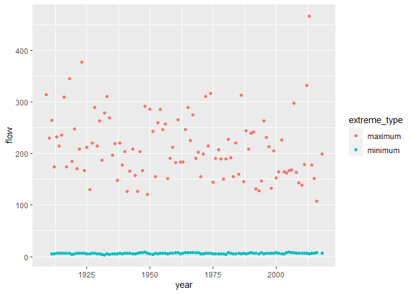
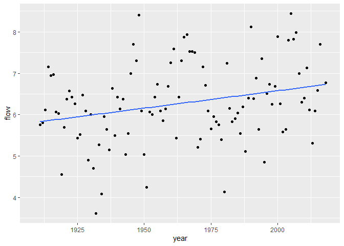

Mini Data-Analysis Deliverable 1
================
Gopal Khanal
2023-10-05

### Welcome to your (maybe) first-ever data analysis project!

And hopefully the first of many. Let’s get started:

1.  Install the [`datateachr`](https://github.com/UBC-MDS/datateachr)
    package by typing the following into your **R terminal**:

<!-- -->

    install.packages("devtools")
    devtools::install_github("UBC-MDS/datateachr")

2.  Load the packages below.

<!-- -->

    ## ── Attaching core tidyverse packages ──────────────────────── tidyverse 2.0.0 ──
    ## ✔ dplyr     1.1.2     ✔ readr     2.1.4
    ## ✔ forcats   1.0.0     ✔ stringr   1.5.0
    ## ✔ ggplot2   3.4.2     ✔ tibble    3.2.1
    ## ✔ lubridate 1.9.2     ✔ tidyr     1.3.0
    ## ✔ purrr     1.0.1     
    ## ── Conflicts ────────────────────────────────────────── tidyverse_conflicts() ──
    ## ✖ dplyr::filter() masks stats::filter()
    ## ✖ dplyr::lag()    masks stats::lag()
    ## ℹ Use the conflicted package (<http://conflicted.r-lib.org/>) to force all conflicts to become errors
    ## Loading required package: colorspace
    ## 
    ## Loading required package: grid
    ## 
    ## The legacy packages maptools, rgdal, and rgeos, underpinning the sp package,
    ## which was just loaded, will retire in October 2023.
    ## Please refer to R-spatial evolution reports for details, especially
    ## https://r-spatial.org/r/2023/05/15/evolution4.html.
    ## It may be desirable to make the sf package available;
    ## package maintainers should consider adding sf to Suggests:.
    ## The sp package is now running under evolution status 2
    ##      (status 2 uses the sf package in place of rgdal)
    ## 
    ## VIM is ready to use.
    ## 
    ## 
    ## Suggestions and bug-reports can be submitted at: https://github.com/statistikat/VIM/issues
    ## 
    ## 
    ## Attaching package: 'VIM'
    ## 
    ## 
    ## The following object is masked from 'package:datasets':
    ## 
    ##     sleep

3.  Make a repository in the <https://github.com/stat545ubc-2023>
    Organization. You can do this by following the steps found on canvas
    in the entry called [MDA: Create a
    repository](https://canvas.ubc.ca/courses/126199/pages/mda-create-a-repository).
    One completed, your repository should automatically be listed as
    part of the stat545ubc-2023 Organization.

# Instructions

## For Both Milestones

- Each milestone has explicit tasks. Tasks that are more challenging
  will often be allocated more points.

- Each milestone will be also graded for reproducibility, cleanliness,
  and coherence of the overall Github submission.

- While the two milestones will be submitted as independent
  deliverables, the analysis itself is a continuum - think of it as two
  chapters to a story. Each chapter, or in this case, portion of your
  analysis, should be easily followed through by someone unfamiliar with
  the content.
  [Here](https://swcarpentry.github.io/r-novice-inflammation/06-best-practices-R/)
  is a good resource for what constitutes “good code”. Learning good
  coding practices early in your career will save you hassle later on!

- The milestones will be equally weighted.

## For Milestone 1

**To complete this milestone**, edit [this very `.Rmd`
file](https://raw.githubusercontent.com/UBC-STAT/stat545.stat.ubc.ca/master/content/mini-project/mini-project-1.Rmd)
directly. Fill in the sections that are tagged with
`<!--- start your work below --->`.

**To submit this milestone**, make sure to knit this `.Rmd` file to an
`.md` file by changing the YAML output settings from
`output: html_document` to `output: github_document`. Commit and push
all of your work to the mini-analysis GitHub repository you made
earlier, and tag a release on GitHub. Then, submit a link to your tagged
release on canvas.

**Points**: This milestone is worth 36 points: 30 for your analysis, and
6 for overall reproducibility, cleanliness, and coherence of the Github
submission.

# Learning Objectives

By the end of this milestone, you should:

- Become familiar with your dataset of choosing
- Select 4 questions that you would like to answer with your data
- Generate a reproducible and clear report using R Markdown
- Become familiar with manipulating and summarizing your data in tibbles
  using `dplyr`, with a research question in mind.

# Task 1: Choose your favorite dataset

The `datateachr` package by Hayley Boyce and Jordan Bourak currently
composed of 7 semi-tidy datasets for educational purposes. Here is a
brief description of each dataset:

- *apt_buildings*: Acquired courtesy of The City of Toronto’s Open Data
  Portal. It currently has 3455 rows and 37 columns.

- *building_permits*: Acquired courtesy of The City of Vancouver’s Open
  Data Portal. It currently has 20680 rows and 14 columns.

- *cancer_sample*: Acquired courtesy of UCI Machine Learning Repository.
  It currently has 569 rows and 32 columns.

- *flow_sample*: Acquired courtesy of The Government of Canada’s
  Historical Hydrometric Database. It currently has 218 rows and 7
  columns.

- *parking_meters*: Acquired courtesy of The City of Vancouver’s Open
  Data Portal. It currently has 10032 rows and 22 columns.

- *steam_games*: Acquired courtesy of Kaggle. It currently has 40833
  rows and 21 columns.

- *vancouver_trees*: Acquired courtesy of The City of Vancouver’s Open
  Data Portal. It currently has 146611 rows and 20 columns.

**Things to keep in mind**

- We hope that this project will serve as practice for carrying our your
  own *independent* data analysis. Remember to comment your code, be
  explicit about what you are doing, and write notes in this markdown
  document when you feel that context is required. As you advance in the
  project, prompts and hints to do this will be diminished - it’ll be up
  to you!

- Before choosing a dataset, you should always keep in mind **your
  goal**, or in other ways, *what you wish to achieve with this data*.
  This mini data-analysis project focuses on *data wrangling*,
  *tidying*, and *visualization*. In short, it’s a way for you to get
  your feet wet with exploring data on your own.

And that is exactly the first thing that you will do!

1.1 **(1 point)** Out of the 7 datasets available in the `datateachr`
package, choose **4** that appeal to you based on their description.
Write your choices below:

**Note**: We encourage you to use the ones in the `datateachr` package,
but if you have a dataset that you’d really like to use, you can include
it here. But, please check with a member of the teaching team to see
whether the dataset is of appropriate complexity. Also, include a
**brief** description of the dataset here to help the teaching team
understand your data.

<!-------------------------- Start your work below ---------------------------->

**Four chosen data**

1.  building_permits
2.  cancer_samples
3.  flow_sample
4.  vancouver_trees

<!----------------------------------------------------------------------------->

1.2 **(6 points)** One way to narrowing down your selection is to
*explore* the datasets. Use your knowledge of dplyr to find out at least
*3* attributes about each of these datasets (an attribute is something
such as number of rows, variables, class type…). The goal here is to
have an idea of *what the data looks like*.

*Hint:* This is one of those times when you should think about the
cleanliness of your analysis. I added a single code chunk for you below,
but do you want to use more than one? Would you like to write more
comments outside of the code chunk?

<!-------------------------- Start your work below ---------------------------->

**Exploring the attributes of chosen data**

# Flow data

``` r
# Overview of the data of row and columns, and col names
glimpse(flow_sample) # I can see here that the flow sample data has 7 variables (cols) and 218                       observation for variables (rows)
```

    ## Rows: 218
    ## Columns: 7
    ## $ station_id   <chr> "05BB001", "05BB001", "05BB001", "05BB001", "05BB001", "0…
    ## $ year         <dbl> 1909, 1910, 1911, 1912, 1913, 1914, 1915, 1916, 1917, 191…
    ## $ extreme_type <chr> "maximum", "maximum", "maximum", "maximum", "maximum", "m…
    ## $ month        <dbl> 7, 6, 6, 8, 6, 6, 6, 6, 6, 6, 6, 7, 6, 6, 6, 7, 5, 7, 6, …
    ## $ day          <dbl> 7, 12, 14, 25, 11, 18, 27, 20, 17, 15, 22, 3, 9, 5, 14, 5…
    ## $ flow         <dbl> 314, 230, 264, 174, 232, 214, 236, 309, 174, 345, 185, 24…
    ## $ sym          <chr> NA, NA, NA, NA, NA, NA, NA, NA, NA, NA, NA, NA, NA, NA, N…

``` r
# class of dataset
class(flow_sample) # The output indicates that the class of data belong to both tibble dataframe and standard tabular struture dataframe in R
```

    ## [1] "tbl_df"     "tbl"        "data.frame"

``` r
# group mean flow by type of the variable 'extreme type'

flow_sample %>% 
 group_by(extreme_type) %>%
  summarise((flow=mean(flow, na.rm=TRUE))) # The mean of extreme max flow is 212.07 m3/sec and mean of extreme min flow is 6.27 m3/sec
```

    ## # A tibble: 2 × 2
    ##   extreme_type `(flow = mean(flow, na.rm = TRUE))`
    ##   <chr>                                      <dbl>
    ## 1 maximum                                   212.  
    ## 2 minimum                                     6.27

``` r
# Other base r variants to call attributes of dataset

head(flow_sample) # Give quick look of the first few cols and rows of the data
```

    ## # A tibble: 6 × 7
    ##   station_id  year extreme_type month   day  flow sym  
    ##   <chr>      <dbl> <chr>        <dbl> <dbl> <dbl> <chr>
    ## 1 05BB001     1909 maximum          7     7   314 <NA> 
    ## 2 05BB001     1910 maximum          6    12   230 <NA> 
    ## 3 05BB001     1911 maximum          6    14   264 <NA> 
    ## 4 05BB001     1912 maximum          8    25   174 <NA> 
    ## 5 05BB001     1913 maximum          6    11   232 <NA> 
    ## 6 05BB001     1914 maximum          6    18   214 <NA>

``` r
str(flow_sample) # Provides structure of the variables of data set.For example, the flow is in numeric structure.
```

    ## tibble [218 × 7] (S3: tbl_df/tbl/data.frame)
    ##  $ station_id  : chr [1:218] "05BB001" "05BB001" "05BB001" "05BB001" ...
    ##  $ year        : num [1:218] 1909 1910 1911 1912 1913 ...
    ##  $ extreme_type: chr [1:218] "maximum" "maximum" "maximum" "maximum" ...
    ##  $ month       : num [1:218] 7 6 6 8 6 6 6 6 6 6 ...
    ##  $ day         : num [1:218] 7 12 14 25 11 18 27 20 17 15 ...
    ##  $ flow        : num [1:218] 314 230 264 174 232 214 236 309 174 345 ...
    ##  $ sym         : chr [1:218] NA NA NA NA ...

``` r
summary(flow_sample) # Summarizes observations (mean, max and others) for each variable or columns
```

    ##   station_id             year      extreme_type           month       
    ##  Length:218         Min.   :1909   Length:218         Min.   : 1.000  
    ##  Class :character   1st Qu.:1936   Class :character   1st Qu.: 3.000  
    ##  Mode  :character   Median :1963   Mode  :character   Median : 6.000  
    ##                     Mean   :1963                      Mean   : 5.046  
    ##                     3rd Qu.:1990                      3rd Qu.: 6.000  
    ##                     Max.   :2018                      Max.   :12.000  
    ##                                                       NA's   :2       
    ##       day             flow            sym           
    ##  Min.   : 1.00   Min.   :  3.62   Length:218        
    ##  1st Qu.: 8.00   1st Qu.:  6.18   Class :character  
    ##  Median :17.00   Median :114.00   Mode  :character  
    ##  Mean   :16.24   Mean   :110.13                     
    ##  3rd Qu.:25.00   3rd Qu.:204.25                     
    ##  Max.   :31.00   Max.   :466.00                     
    ##  NA's   :2       NA's   :2

# Vancouver tree data

``` r
# Overview of the row and columns, and col names
 glimpse(vancouver_trees) # There 20 columns (var) and 146611 observations. Main variables are tree id, species name, and diameter among other.
```

    ## Rows: 146,611
    ## Columns: 20
    ## $ tree_id            <dbl> 149556, 149563, 149579, 149590, 149604, 149616, 149…
    ## $ civic_number       <dbl> 494, 450, 4994, 858, 5032, 585, 4909, 4925, 4969, 7…
    ## $ std_street         <chr> "W 58TH AV", "W 58TH AV", "WINDSOR ST", "E 39TH AV"…
    ## $ genus_name         <chr> "ULMUS", "ZELKOVA", "STYRAX", "FRAXINUS", "ACER", "…
    ## $ species_name       <chr> "AMERICANA", "SERRATA", "JAPONICA", "AMERICANA", "C…
    ## $ cultivar_name      <chr> "BRANDON", NA, NA, "AUTUMN APPLAUSE", NA, "CHANTICL…
    ## $ common_name        <chr> "BRANDON ELM", "JAPANESE ZELKOVA", "JAPANESE SNOWBE…
    ## $ assigned           <chr> "N", "N", "N", "Y", "N", "N", "N", "N", "N", "N", "…
    ## $ root_barrier       <chr> "N", "N", "N", "N", "N", "N", "N", "N", "N", "N", "…
    ## $ plant_area         <chr> "N", "N", "4", "4", "4", "B", "6", "6", "3", "3", "…
    ## $ on_street_block    <dbl> 400, 400, 4900, 800, 5000, 500, 4900, 4900, 4900, 7…
    ## $ on_street          <chr> "W 58TH AV", "W 58TH AV", "WINDSOR ST", "E 39TH AV"…
    ## $ neighbourhood_name <chr> "MARPOLE", "MARPOLE", "KENSINGTON-CEDAR COTTAGE", "…
    ## $ street_side_name   <chr> "EVEN", "EVEN", "EVEN", "EVEN", "EVEN", "ODD", "ODD…
    ## $ height_range_id    <dbl> 2, 4, 3, 4, 2, 2, 3, 3, 2, 2, 2, 5, 3, 2, 2, 2, 2, …
    ## $ diameter           <dbl> 10.00, 10.00, 4.00, 18.00, 9.00, 5.00, 15.00, 14.00…
    ## $ curb               <chr> "N", "N", "Y", "Y", "Y", "Y", "Y", "Y", "Y", "Y", "…
    ## $ date_planted       <date> 1999-01-13, 1996-05-31, 1993-11-22, 1996-04-29, 19…
    ## $ longitude          <dbl> -123.1161, -123.1147, -123.0846, -123.0870, -123.08…
    ## $ latitude           <dbl> 49.21776, 49.21776, 49.23938, 49.23469, 49.23894, 4…

``` r
# dimesion of data
dim(vancouver_trees) # There 20 columns and 146611 rows in the data.
```

    ## [1] 146611     20

``` r
# mean diameter of all trees irrespective of species, and types.
vancouver_trees %>% 
 summarise((avg=mean(diameter, na.rm=TRUE))) # The mean diameter of trees is 11.49 inch.
```

    ## # A tibble: 1 × 1
    ##   `(avg = mean(diameter, na.rm = TRUE))`
    ##                                    <dbl>
    ## 1                                   11.5

``` r
# I wanted to see average diameter of tree when tree has "Curb" or not.
# It looks like trees having 'curb' have less average diameter than not having curb
# Average diameter of tree with curb is 11.38 in whereas without curb is 12.57 inch
vancouver_trees %>% 
group_by(curb) %>%
summarise((avg=mean(diameter, na.rm=TRUE))) 
```

    ## # A tibble: 2 × 2
    ##   curb  `(avg = mean(diameter, na.rm = TRUE))`
    ##   <chr>                                  <dbl>
    ## 1 N                                       12.6
    ## 2 Y                                       11.4

``` r
# Other base r variants to call attributes of dataset
class(vancouver_trees) # the data has both standard dataframe and tibble class
```

    ## [1] "tbl_df"     "tbl"        "data.frame"

``` r
head(vancouver_trees) # Shows first few rows and columns of the data
```

    ## # A tibble: 6 × 20
    ##   tree_id civic_number std_street genus_name species_name cultivar_name  
    ##     <dbl>        <dbl> <chr>      <chr>      <chr>        <chr>          
    ## 1  149556          494 W 58TH AV  ULMUS      AMERICANA    BRANDON        
    ## 2  149563          450 W 58TH AV  ZELKOVA    SERRATA      <NA>           
    ## 3  149579         4994 WINDSOR ST STYRAX     JAPONICA     <NA>           
    ## 4  149590          858 E 39TH AV  FRAXINUS   AMERICANA    AUTUMN APPLAUSE
    ## 5  149604         5032 WINDSOR ST ACER       CAMPESTRE    <NA>           
    ## 6  149616          585 W 61ST AV  PYRUS      CALLERYANA   CHANTICLEER    
    ## # ℹ 14 more variables: common_name <chr>, assigned <chr>, root_barrier <chr>,
    ## #   plant_area <chr>, on_street_block <dbl>, on_street <chr>,
    ## #   neighbourhood_name <chr>, street_side_name <chr>, height_range_id <dbl>,
    ## #   diameter <dbl>, curb <chr>, date_planted <date>, longitude <dbl>,
    ## #   latitude <dbl>

``` r
str(vancouver_trees) # Shows structure of the variable (numeric,character or other)
```

    ## tibble [146,611 × 20] (S3: tbl_df/tbl/data.frame)
    ##  $ tree_id           : num [1:146611] 149556 149563 149579 149590 149604 ...
    ##  $ civic_number      : num [1:146611] 494 450 4994 858 5032 ...
    ##  $ std_street        : chr [1:146611] "W 58TH AV" "W 58TH AV" "WINDSOR ST" "E 39TH AV" ...
    ##  $ genus_name        : chr [1:146611] "ULMUS" "ZELKOVA" "STYRAX" "FRAXINUS" ...
    ##  $ species_name      : chr [1:146611] "AMERICANA" "SERRATA" "JAPONICA" "AMERICANA" ...
    ##  $ cultivar_name     : chr [1:146611] "BRANDON" NA NA "AUTUMN APPLAUSE" ...
    ##  $ common_name       : chr [1:146611] "BRANDON ELM" "JAPANESE ZELKOVA" "JAPANESE SNOWBELL" "AUTUMN APPLAUSE ASH" ...
    ##  $ assigned          : chr [1:146611] "N" "N" "N" "Y" ...
    ##  $ root_barrier      : chr [1:146611] "N" "N" "N" "N" ...
    ##  $ plant_area        : chr [1:146611] "N" "N" "4" "4" ...
    ##  $ on_street_block   : num [1:146611] 400 400 4900 800 5000 500 4900 4900 4900 700 ...
    ##  $ on_street         : chr [1:146611] "W 58TH AV" "W 58TH AV" "WINDSOR ST" "E 39TH AV" ...
    ##  $ neighbourhood_name: chr [1:146611] "MARPOLE" "MARPOLE" "KENSINGTON-CEDAR COTTAGE" "KENSINGTON-CEDAR COTTAGE" ...
    ##  $ street_side_name  : chr [1:146611] "EVEN" "EVEN" "EVEN" "EVEN" ...
    ##  $ height_range_id   : num [1:146611] 2 4 3 4 2 2 3 3 2 2 ...
    ##  $ diameter          : num [1:146611] 10 10 4 18 9 5 15 14 16 7.5 ...
    ##  $ curb              : chr [1:146611] "N" "N" "Y" "Y" ...
    ##  $ date_planted      : Date[1:146611], format: "1999-01-13" "1996-05-31" ...
    ##  $ longitude         : num [1:146611] -123 -123 -123 -123 -123 ...
    ##  $ latitude          : num [1:146611] 49.2 49.2 49.2 49.2 49.2 ...

# Cancer sample data

``` r
# Overview of the row and column of the data
# The data contains 32 columns (var) and 569 observations of samples.
# Main variables are cancer tumor diagnosis type (malignant or benign ), mean radius of the tumor, and diameter among other.
glimpse(cancer_sample)
```

    ## Rows: 569
    ## Columns: 32
    ## $ ID                      <dbl> 842302, 842517, 84300903, 84348301, 84358402, …
    ## $ diagnosis               <chr> "M", "M", "M", "M", "M", "M", "M", "M", "M", "…
    ## $ radius_mean             <dbl> 17.990, 20.570, 19.690, 11.420, 20.290, 12.450…
    ## $ texture_mean            <dbl> 10.38, 17.77, 21.25, 20.38, 14.34, 15.70, 19.9…
    ## $ perimeter_mean          <dbl> 122.80, 132.90, 130.00, 77.58, 135.10, 82.57, …
    ## $ area_mean               <dbl> 1001.0, 1326.0, 1203.0, 386.1, 1297.0, 477.1, …
    ## $ smoothness_mean         <dbl> 0.11840, 0.08474, 0.10960, 0.14250, 0.10030, 0…
    ## $ compactness_mean        <dbl> 0.27760, 0.07864, 0.15990, 0.28390, 0.13280, 0…
    ## $ concavity_mean          <dbl> 0.30010, 0.08690, 0.19740, 0.24140, 0.19800, 0…
    ## $ concave_points_mean     <dbl> 0.14710, 0.07017, 0.12790, 0.10520, 0.10430, 0…
    ## $ symmetry_mean           <dbl> 0.2419, 0.1812, 0.2069, 0.2597, 0.1809, 0.2087…
    ## $ fractal_dimension_mean  <dbl> 0.07871, 0.05667, 0.05999, 0.09744, 0.05883, 0…
    ## $ radius_se               <dbl> 1.0950, 0.5435, 0.7456, 0.4956, 0.7572, 0.3345…
    ## $ texture_se              <dbl> 0.9053, 0.7339, 0.7869, 1.1560, 0.7813, 0.8902…
    ## $ perimeter_se            <dbl> 8.589, 3.398, 4.585, 3.445, 5.438, 2.217, 3.18…
    ## $ area_se                 <dbl> 153.40, 74.08, 94.03, 27.23, 94.44, 27.19, 53.…
    ## $ smoothness_se           <dbl> 0.006399, 0.005225, 0.006150, 0.009110, 0.0114…
    ## $ compactness_se          <dbl> 0.049040, 0.013080, 0.040060, 0.074580, 0.0246…
    ## $ concavity_se            <dbl> 0.05373, 0.01860, 0.03832, 0.05661, 0.05688, 0…
    ## $ concave_points_se       <dbl> 0.015870, 0.013400, 0.020580, 0.018670, 0.0188…
    ## $ symmetry_se             <dbl> 0.03003, 0.01389, 0.02250, 0.05963, 0.01756, 0…
    ## $ fractal_dimension_se    <dbl> 0.006193, 0.003532, 0.004571, 0.009208, 0.0051…
    ## $ radius_worst            <dbl> 25.38, 24.99, 23.57, 14.91, 22.54, 15.47, 22.8…
    ## $ texture_worst           <dbl> 17.33, 23.41, 25.53, 26.50, 16.67, 23.75, 27.6…
    ## $ perimeter_worst         <dbl> 184.60, 158.80, 152.50, 98.87, 152.20, 103.40,…
    ## $ area_worst              <dbl> 2019.0, 1956.0, 1709.0, 567.7, 1575.0, 741.6, …
    ## $ smoothness_worst        <dbl> 0.1622, 0.1238, 0.1444, 0.2098, 0.1374, 0.1791…
    ## $ compactness_worst       <dbl> 0.6656, 0.1866, 0.4245, 0.8663, 0.2050, 0.5249…
    ## $ concavity_worst         <dbl> 0.71190, 0.24160, 0.45040, 0.68690, 0.40000, 0…
    ## $ concave_points_worst    <dbl> 0.26540, 0.18600, 0.24300, 0.25750, 0.16250, 0…
    ## $ symmetry_worst          <dbl> 0.4601, 0.2750, 0.3613, 0.6638, 0.2364, 0.3985…
    ## $ fractal_dimension_worst <dbl> 0.11890, 0.08902, 0.08758, 0.17300, 0.07678, 0…

``` r
# dimension of data 
dim(cancer_sample) #The data contains 32 columns (var) and 569 observation
```

    ## [1] 569  32

``` r
# I wanted to see whether mean area of the cell nuclei differs depending upon whether tumor was of benign or malignant type
# It looks like that malignant type of tumors have larger area (978.37 sq. unit) than that of benign type (462.79 sq. unit) 

cancer_sample %>% 
  group_by(diagnosis) %>%
summarise((avg=mean(area_mean, na.rm=TRUE)))
```

    ## # A tibble: 2 × 2
    ##   diagnosis `(avg = mean(area_mean, na.rm = TRUE))`
    ##   <chr>                                       <dbl>
    ## 1 B                                            463.
    ## 2 M                                            978.

``` r
# I wanted to see maximum of the worst tumor
# The output show that max area of worst tumors have area of 4254 sq. unit)

cancer_sample %>% 
summarise((maximum.area=max(area_worst, na.rm=TRUE)))
```

    ## # A tibble: 1 × 1
    ##   `(maximum.area = max(area_worst, na.rm = TRUE))`
    ##                                              <dbl>
    ## 1                                             4254

``` r
# Other base r variants to call attributes of dataset
head(cancer_sample) # Give quick look of the first few cols and rows of the data
```

    ## # A tibble: 6 × 32
    ##         ID diagnosis radius_mean texture_mean perimeter_mean area_mean
    ##      <dbl> <chr>           <dbl>        <dbl>          <dbl>     <dbl>
    ## 1   842302 M                18.0         10.4          123.      1001 
    ## 2   842517 M                20.6         17.8          133.      1326 
    ## 3 84300903 M                19.7         21.2          130       1203 
    ## 4 84348301 M                11.4         20.4           77.6      386.
    ## 5 84358402 M                20.3         14.3          135.      1297 
    ## 6   843786 M                12.4         15.7           82.6      477.
    ## # ℹ 26 more variables: smoothness_mean <dbl>, compactness_mean <dbl>,
    ## #   concavity_mean <dbl>, concave_points_mean <dbl>, symmetry_mean <dbl>,
    ## #   fractal_dimension_mean <dbl>, radius_se <dbl>, texture_se <dbl>,
    ## #   perimeter_se <dbl>, area_se <dbl>, smoothness_se <dbl>,
    ## #   compactness_se <dbl>, concavity_se <dbl>, concave_points_se <dbl>,
    ## #   symmetry_se <dbl>, fractal_dimension_se <dbl>, radius_worst <dbl>,
    ## #   texture_worst <dbl>, perimeter_worst <dbl>, area_worst <dbl>, …

``` r
str(cancer_sample)# Provides structure of the variables of data set.For example, the area is in numeric structure.
```

    ## spc_tbl_ [569 × 32] (S3: spec_tbl_df/tbl_df/tbl/data.frame)
    ##  $ ID                     : num [1:569] 842302 842517 84300903 84348301 84358402 ...
    ##  $ diagnosis              : chr [1:569] "M" "M" "M" "M" ...
    ##  $ radius_mean            : num [1:569] 18 20.6 19.7 11.4 20.3 ...
    ##  $ texture_mean           : num [1:569] 10.4 17.8 21.2 20.4 14.3 ...
    ##  $ perimeter_mean         : num [1:569] 122.8 132.9 130 77.6 135.1 ...
    ##  $ area_mean              : num [1:569] 1001 1326 1203 386 1297 ...
    ##  $ smoothness_mean        : num [1:569] 0.1184 0.0847 0.1096 0.1425 0.1003 ...
    ##  $ compactness_mean       : num [1:569] 0.2776 0.0786 0.1599 0.2839 0.1328 ...
    ##  $ concavity_mean         : num [1:569] 0.3001 0.0869 0.1974 0.2414 0.198 ...
    ##  $ concave_points_mean    : num [1:569] 0.1471 0.0702 0.1279 0.1052 0.1043 ...
    ##  $ symmetry_mean          : num [1:569] 0.242 0.181 0.207 0.26 0.181 ...
    ##  $ fractal_dimension_mean : num [1:569] 0.0787 0.0567 0.06 0.0974 0.0588 ...
    ##  $ radius_se              : num [1:569] 1.095 0.543 0.746 0.496 0.757 ...
    ##  $ texture_se             : num [1:569] 0.905 0.734 0.787 1.156 0.781 ...
    ##  $ perimeter_se           : num [1:569] 8.59 3.4 4.58 3.44 5.44 ...
    ##  $ area_se                : num [1:569] 153.4 74.1 94 27.2 94.4 ...
    ##  $ smoothness_se          : num [1:569] 0.0064 0.00522 0.00615 0.00911 0.01149 ...
    ##  $ compactness_se         : num [1:569] 0.049 0.0131 0.0401 0.0746 0.0246 ...
    ##  $ concavity_se           : num [1:569] 0.0537 0.0186 0.0383 0.0566 0.0569 ...
    ##  $ concave_points_se      : num [1:569] 0.0159 0.0134 0.0206 0.0187 0.0188 ...
    ##  $ symmetry_se            : num [1:569] 0.03 0.0139 0.0225 0.0596 0.0176 ...
    ##  $ fractal_dimension_se   : num [1:569] 0.00619 0.00353 0.00457 0.00921 0.00511 ...
    ##  $ radius_worst           : num [1:569] 25.4 25 23.6 14.9 22.5 ...
    ##  $ texture_worst          : num [1:569] 17.3 23.4 25.5 26.5 16.7 ...
    ##  $ perimeter_worst        : num [1:569] 184.6 158.8 152.5 98.9 152.2 ...
    ##  $ area_worst             : num [1:569] 2019 1956 1709 568 1575 ...
    ##  $ smoothness_worst       : num [1:569] 0.162 0.124 0.144 0.21 0.137 ...
    ##  $ compactness_worst      : num [1:569] 0.666 0.187 0.424 0.866 0.205 ...
    ##  $ concavity_worst        : num [1:569] 0.712 0.242 0.45 0.687 0.4 ...
    ##  $ concave_points_worst   : num [1:569] 0.265 0.186 0.243 0.258 0.163 ...
    ##  $ symmetry_worst         : num [1:569] 0.46 0.275 0.361 0.664 0.236 ...
    ##  $ fractal_dimension_worst: num [1:569] 0.1189 0.089 0.0876 0.173 0.0768 ...
    ##  - attr(*, "spec")=
    ##   .. cols(
    ##   ..   ID = col_double(),
    ##   ..   diagnosis = col_character(),
    ##   ..   radius_mean = col_double(),
    ##   ..   texture_mean = col_double(),
    ##   ..   perimeter_mean = col_double(),
    ##   ..   area_mean = col_double(),
    ##   ..   smoothness_mean = col_double(),
    ##   ..   compactness_mean = col_double(),
    ##   ..   concavity_mean = col_double(),
    ##   ..   concave_points_mean = col_double(),
    ##   ..   symmetry_mean = col_double(),
    ##   ..   fractal_dimension_mean = col_double(),
    ##   ..   radius_se = col_double(),
    ##   ..   texture_se = col_double(),
    ##   ..   perimeter_se = col_double(),
    ##   ..   area_se = col_double(),
    ##   ..   smoothness_se = col_double(),
    ##   ..   compactness_se = col_double(),
    ##   ..   concavity_se = col_double(),
    ##   ..   concave_points_se = col_double(),
    ##   ..   symmetry_se = col_double(),
    ##   ..   fractal_dimension_se = col_double(),
    ##   ..   radius_worst = col_double(),
    ##   ..   texture_worst = col_double(),
    ##   ..   perimeter_worst = col_double(),
    ##   ..   area_worst = col_double(),
    ##   ..   smoothness_worst = col_double(),
    ##   ..   compactness_worst = col_double(),
    ##   ..   concavity_worst = col_double(),
    ##   ..   concave_points_worst = col_double(),
    ##   ..   symmetry_worst = col_double(),
    ##   ..   fractal_dimension_worst = col_double()
    ##   .. )

# Building permits data

``` r
# Overview of the row and columns of data
# The data has 20680 building permits (observations) and 14 variables (attributes) associated with building permits
glimpse(building_permits)
```

    ## Rows: 20,680
    ## Columns: 14
    ## $ permit_number               <chr> "BP-2016-02248", "BU468090", "DB-2016-0445…
    ## $ issue_date                  <date> 2017-02-01, 2017-02-01, 2017-02-01, 2017-…
    ## $ project_value               <dbl> 0, 0, 35000, 15000, 181178, 0, 15000, 0, 6…
    ## $ type_of_work                <chr> "Salvage and Abatement", "New Building", "…
    ## $ address                     <chr> "4378 W 9TH AVENUE, Vancouver, BC V6R 2C7"…
    ## $ project_description         <chr> NA, NA, NA, NA, NA, NA, NA, NA, NA, NA, NA…
    ## $ building_contractor         <chr> NA, NA, NA, "Mercury Contracting Ltd", "08…
    ## $ building_contractor_address <chr> NA, NA, NA, "88 W PENDER ST  \r\nUnit 2069…
    ## $ applicant                   <chr> "Raffaele & Associates DBA: Raffaele and A…
    ## $ applicant_address           <chr> "2642 East Hastings\r\nVancouver, BC  V5K …
    ## $ property_use                <chr> "Dwelling Uses", "Dwelling Uses", "Dwellin…
    ## $ specific_use_category       <chr> "One-Family Dwelling", "Multiple Dwelling"…
    ## $ year                        <dbl> 2017, 2017, 2017, 2017, 2017, 2017, 2017, …
    ## $ bi_id                       <dbl> 524, 535, 539, 541, 543, 546, 547, 548, 54…

``` r
# I wanted to see the total number of housing permits every year
# It looks like the year 2018 had highest permit numbers (6758) whereas 2020 had the lowest permits(1616)
building_permits%>%
  group_by(year) %>%
summarise(n= n())
```

    ## # A tibble: 4 × 2
    ##    year     n
    ##   <dbl> <int>
    ## 1  2017  6734
    ## 2  2018  6758
    ## 3  2019  5572
    ## 4  2020  1616

``` r
# Other base r variants to call attributes of dataset

head(building_permits) # Give quick look of the first few cols and rows of the data
```

    ## # A tibble: 6 × 14
    ##   permit_number issue_date project_value type_of_work          address          
    ##   <chr>         <date>             <dbl> <chr>                 <chr>            
    ## 1 BP-2016-02248 2017-02-01             0 Salvage and Abatement 4378 W 9TH AVENU…
    ## 2 BU468090      2017-02-01             0 New Building          1111 RICHARDS ST…
    ## 3 DB-2016-04450 2017-02-01         35000 Addition / Alteration 3732 W 12TH AVEN…
    ## 4 DB-2017-00131 2017-02-01         15000 Addition / Alteration 88 W PENDER STRE…
    ## 5 DB452250      2017-02-01        181178 New Building          492 E 62ND AVENU…
    ## 6 BP-2016-01458 2017-02-02             0 Salvage and Abatement 3332 W 28TH AVEN…
    ## # ℹ 9 more variables: project_description <chr>, building_contractor <chr>,
    ## #   building_contractor_address <chr>, applicant <chr>,
    ## #   applicant_address <chr>, property_use <chr>, specific_use_category <chr>,
    ## #   year <dbl>, bi_id <dbl>

``` r
str(building_permits)# Provides structure of the variables of data set.For example, the year is in numeric structure.
```

    ## spc_tbl_ [20,680 × 14] (S3: spec_tbl_df/tbl_df/tbl/data.frame)
    ##  $ permit_number              : chr [1:20680] "BP-2016-02248" "BU468090" "DB-2016-04450" "DB-2017-00131" ...
    ##  $ issue_date                 : Date[1:20680], format: "2017-02-01" "2017-02-01" ...
    ##  $ project_value              : num [1:20680] 0 0 35000 15000 181178 ...
    ##  $ type_of_work               : chr [1:20680] "Salvage and Abatement" "New Building" "Addition / Alteration" "Addition / Alteration" ...
    ##  $ address                    : chr [1:20680] "4378 W 9TH AVENUE, Vancouver, BC V6R 2C7" "1111 RICHARDS STREET, Vancouver, BC V1V 1V1" "3732 W 12TH AVENUE, Vancouver, BC V6R 2N6" "88 W PENDER STREET, Vancouver, BC V6B 6N9" ...
    ##  $ project_description        : chr [1:20680] NA NA NA NA ...
    ##  $ building_contractor        : chr [1:20680] NA NA NA "Mercury Contracting Ltd" ...
    ##  $ building_contractor_address: chr [1:20680] NA NA NA "88 W PENDER ST  \r\nUnit 2069\r\nVancouver, BC  V6B 6N9" ...
    ##  $ applicant                  : chr [1:20680] "Raffaele & Associates DBA: Raffaele and Associates" "MAX KERR" "Peter  Nicol" "Aaron Vaughan DBA: Mercury Contracting" ...
    ##  $ applicant_address          : chr [1:20680] "2642 East Hastings\r\nVancouver, BC  V5K 1Z6" "BRENHILL DEVELOPMENTS LTD\r\n487 HELMCKEN ST\r\nVANCOUVER, BC  V5T1R8" "3722 W 12th Ave\r\nVancouver, BC  V6R 2N6" "2097-88 W Pender St\r\nVancouver, BC  V6B 6N9" ...
    ##  $ property_use               : chr [1:20680] "Dwelling Uses" "Dwelling Uses" "Dwelling Uses" "Office Uses,Retail Uses" ...
    ##  $ specific_use_category      : chr [1:20680] "One-Family Dwelling" "Multiple Dwelling" "One-Family Dwelling" "General Office, Retail Store" ...
    ##  $ year                       : num [1:20680] 2017 2017 2017 2017 2017 ...
    ##  $ bi_id                      : num [1:20680] 524 535 539 541 543 546 547 548 549 550 ...
    ##  - attr(*, "spec")=
    ##   .. cols(
    ##   ..   PermitNumber = col_character(),
    ##   ..   IssueDate = col_date(format = ""),
    ##   ..   ProjectValue = col_double(),
    ##   ..   TypeOfWork = col_character(),
    ##   ..   Address = col_character(),
    ##   ..   ProjectDescription = col_character(),
    ##   ..   BuildingContractor = col_character(),
    ##   ..   BuildingContractorAddress = col_character(),
    ##   ..   Applicant = col_character(),
    ##   ..   ApplicantAddress = col_character(),
    ##   ..   PropertyUse = col_character(),
    ##   ..   SpecificUseCategory = col_character(),
    ##   ..   Year = col_double(),
    ##   ..   BI_ID = col_double()
    ##   .. )

<!----------------------------------------------------------------------------->

1.3 **(1 point)** Now that you’ve explored the 4 datasets that you were
initially most interested in, let’s narrow it down to 1. What lead you
to choose this one? Briefly explain your choice below.

<!-------------------------- Start your work below ---------------------------->

**Reason for selection of data**

*I’ve chosen the flow_sample data because it has annual trends of flow
over long period of time, and I wanted to see how that varies over time
and months. And there are some missing values as well to account for and
to play with for data wrangling.*

<!----------------------------------------------------------------------------->

1.4 **(2 points)** Time for a final decision! Going back to the
beginning, it’s important to have an *end goal* in mind. For example, if
I had chosen the `titanic` dataset for my project, I might’ve wanted to
explore the relationship between survival and other variables. Try to
think of 1 research question that you would want to answer with your
dataset. Note it down below.

<!-------------------------- Start your work below ---------------------------->

*Using flow data, I want to assess whether there is any significant
temporal trend in annual extremes (minimum and maximum) of flow. I also
want to determine whether there is difference in extreme flows among
decades, and whether any particular months has extreme flows or the
extreme flows are consistent across years with regards to months.*

<!----------------------------------------------------------------------------->

# Important note

Read Tasks 2 and 3 *fully* before starting to complete either of them.
Probably also a good point to grab a coffee to get ready for the fun
part!

This project is semi-guided, but meant to be *independent*. For this
reason, you will complete tasks 2 and 3 below (under the **START HERE**
mark) as if you were writing your own exploratory data analysis report,
and this guidance never existed! Feel free to add a brief introduction
section to your project, format the document with markdown syntax as you
deem appropriate, and structure the analysis as you deem appropriate. If
you feel lost, you can find a sample data analysis
[here](https://www.kaggle.com/headsortails/tidy-titarnic) to have a
better idea. However, bear in mind that it is **just an example** and
you will not be required to have that level of complexity in your
project.

# Task 2: Exploring your dataset

If we rewind and go back to the learning objectives, you’ll see that by
the end of this deliverable, you should have formulated *4* research
questions about your data that you may want to answer during your
project. However, it may be handy to do some more exploration on your
dataset of choice before creating these questions - by looking at the
data, you may get more ideas. **Before you start this task, read all
instructions carefully until you reach START HERE under Task 3**.

2.1 **(12 points)** Complete *4 out of the following 8 exercises* to
dive deeper into your data. All datasets are different and therefore,
not all of these tasks may make sense for your data - which is why you
should only answer *4*.

Make sure that you’re using dplyr and ggplot2 rather than base R for
this task. Outside of this project, you may find that you prefer using
base R functions for certain tasks, and that’s just fine! But part of
this project is for you to practice the tools we learned in class, which
is dplyr and ggplot2.

1.  Plot the distribution of a numeric variable.
2.  Create a new variable based on other variables in your data (only if
    it makes sense)
3.  Investigate how many missing values there are per variable. Can you
    find a way to plot this?
4.  Explore the relationship between 2 variables in a plot.
5.  Filter observations in your data according to your own criteria.
    Think of what you’d like to explore - again, if this was the
    `titanic` dataset, I may want to narrow my search down to passengers
    born in a particular year…
6.  Use a boxplot to look at the frequency of different observations
    within a single variable. You can do this for more than one variable
    if you wish!
7.  Make a new tibble with a subset of your data, with variables and
    observations that you are interested in exploring.
8.  Use a density plot to explore any of your variables (that are
    suitable for this type of plot).

2.2 **(4 points)** For each of the 4 exercises that you complete,
provide a *brief explanation* of why you chose that exercise in relation
to your data (in other words, why does it make sense to do that?), and
sufficient comments for a reader to understand your reasoning and code.

<!-------------------------- Start your work below ---------------------------->

**Q1.Plot the distribution of a numeric variable.**

``` r
# Plotting the flow (m3/sec) irrespective of whether it is extreme minimum or maximum
# It is clear in the histogram that min flow and max flow are distributed distinctly
flow_sample %>%
    ggplot(aes(x=flow)) +
  geom_histogram(binwidth=30, colour="black", fill="white")
```

    ## Warning: Removed 2 rows containing non-finite values (`stat_bin()`).

<!-- -->

``` r
#Filter and plot the distribution of maximum flow

flow_sample%>% 
  filter(extreme_type=="maximum") %>%
  ggplot(aes(x=flow)) +
  geom_histogram(binwidth=50, colour="black", fill="white")
```

<!-- -->

``` r
#Filter and plot the distribution of minimum flow

flow_sample%>% 
  filter(extreme_type=="minimum") %>%
  ggplot(aes(x=flow)) +
  geom_histogram(binwidth=1, colour="black", fill="white")
```

    ## Warning: Removed 2 rows containing non-finite values (`stat_bin()`).

<!-- -->

**Q2. Investigate how many missing values there are per variable. Can
you find a way to plot this?**

``` r
#Check if there are many missing values 
any(is.na(flow_sample$flow))
```

    ## [1] TRUE

``` r
#Mapping the number of missing observation for each variable and sorting them.
aggr(flow_sample, prop = FALSE, combined = TRUE, numbers = TRUE, sortVars = TRUE, sortCombs = TRUE)
```

<!-- -->

    ## 
    ##  Variables sorted by number of missings: 
    ##      Variable Count
    ##           sym   119
    ##         month     2
    ##           day     2
    ##          flow     2
    ##    station_id     0
    ##          year     0
    ##  extreme_type     0

**Q3. Explore the relationship between 2 variables in a plot.**

``` r
# Here, I explored whether there has been any relationship between year and flow
# The flow variability over the year doesn't seem to show any unusual trend (based #on eye balling)
# But we have to be careful with this eyeballing because flow type (extreme type) could be obscuring the actual trend
# We ideally need to plot flow based on its extreme types
# Which I'll be doing in subsequent exercises. 
flow_sample %>%
   ggplot(aes(x=year, y=flow)) +
   geom_point(aes(color = extreme_type))
```

<!-- -->

**Q4. Filter observations in your data according to your own criteria**

``` r
# I would like to narrow down to maximum flow of each year and
# see whether there is any statistical trend in it
flow_sample %>% filter(extreme_type=="maximum") %>%
  ggplot(aes(year, flow)) +
  geom_point() +
  geom_smooth (method = "lm", se=FALSE)
```

    ## `geom_smooth()` using formula = 'y ~ x'

<!-- -->

``` r
# There appears to be decreasing trend in yearly maximum flow over the years
```

``` r
## How about trend in minimum flow over the years?
filter(flow_sample, extreme_type=="minimum") %>%
  ggplot(aes(x=year, y=flow), rm.na=TRUE) +
  geom_point() +
  geom_smooth(method = "lm", se = FALSE)
```

    ## `geom_smooth()` using formula = 'y ~ x'

<!-- -->

``` r
## It looks like there is positive trend in minimum flow over the year
## But I haven't checked whether the trend is statistically significant using regression models
## I'll be doing regression analysis to see if there statistical trends in flow over the years
```

<!----------------------------------------------------------------------------->

# Task 3: Choose research questions

**(4 points)** So far, you have chosen a dataset and gotten familiar
with it through exploring the data. You have also brainstormed one
research question that interested you (Task 1.4). Now it’s time to pick
4 research questions that you would like to explore in Milestone 2!
Write the 4 questions and any additional comments below.

<!--- *****START HERE***** --->

**Based on eye balling of scatter plot of flow over years show that
minimum flow appears to be increasing over the years whereas the maximum
flow appears to be reflecting the decreasing trend. But we don’t know
whether these trends are statistically significant. I’m therefore
interested in examining following four questions in the next independent
exercise.**

1.  Whether there there is statistically significant trend in both
    extreme minimum, and extreme maximum flow (m3/sec) over the years?
    I’ll use linear regression model to see annual trends. I’ll check
    the significance of beta coefficient. I’ll also try and explore
    non-parametric Mann-Kendall and Sen’s methods tests to determine
    whether there is a significant positive or negative trend in flow.

2.  Compare flow pattern among decades:whether there are some decades
    (say 1970-1980) with unusual extreme min and max flow? Which years
    had more than average of extreme maximum flow? Are extreme flows
    (both min and max) after 2000 different than those before 2000? If
    there has been consistent increase in extreme max flow after 2000,
    this MAY be signature of increase in extreme rainfall after 2000 or
    MAY be of extreme runoff in the rivers due to deforestation in the
    catchment area.

3.  Are flow patterns consistent across years with regards to months? Or
    has there been any shift in months which has highest extreme maximum
    flow or min flow?

4.  Which months have extreme min and extreme max flow? Whether
    particular months have unusually high extreme max flow over the
    years ?

<!----------------------------->

# Overall reproducibility/Cleanliness/Coherence Checklist

## Coherence (0.5 points)

The document should read sensibly from top to bottom, with no major
continuity errors. An example of a major continuity error is having a
data set listed for Task 3 that is not part of one of the data sets
listed in Task 1.

## Error-free code (3 points)

For full marks, all code in the document should run without error. 1
point deduction if most code runs without error, and 2 points deduction
if more than 50% of the code throws an error.

## Main README (1 point)

There should be a file named `README.md` at the top level of your
repository. Its contents should automatically appear when you visit the
repository on GitHub.

Minimum contents of the README file:

- In a sentence or two, explains what this repository is, so that
  future-you or someone else stumbling on your repository can be
  oriented to the repository.
- In a sentence or two (or more??), briefly explains how to engage with
  the repository. You can assume the person reading knows the material
  from STAT 545A. Basically, if a visitor to your repository wants to
  explore your project, what should they know?

Once you get in the habit of making README files, and seeing more README
files in other projects, you’ll wonder how you ever got by without them!
They are tremendously helpful.

## Output (1 point)

All output is readable, recent and relevant:

- All Rmd files have been `knit`ted to their output md files.
- All knitted md files are viewable without errors on Github. Examples
  of errors: Missing plots, “Sorry about that, but we can’t show files
  that are this big right now” messages, error messages from broken R
  code
- All of these output files are up-to-date – that is, they haven’t
  fallen behind after the source (Rmd) files have been updated.
- There should be no relic output files. For example, if you were
  knitting an Rmd to html, but then changed the output to be only a
  markdown file, then the html file is a relic and should be deleted.

(0.5 point deduction if any of the above criteria are not met. 1 point
deduction if most or all of the above criteria are not met.)

Our recommendation: right before submission, delete all output files,
and re-knit each milestone’s Rmd file, so that everything is up to date
and relevant. Then, after your final commit and push to Github, CHECK on
Github to make sure that everything looks the way you intended!

## Tagged release (0.5 points)

You’ve tagged a release for Milestone 1.

### Attribution

Thanks to Icíar Fernández Boyano for mostly putting this together, and
Vincenzo Coia for launching.
