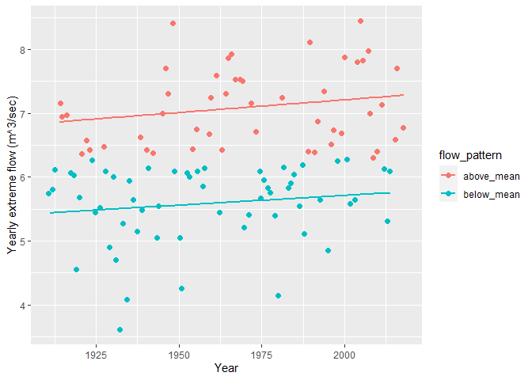
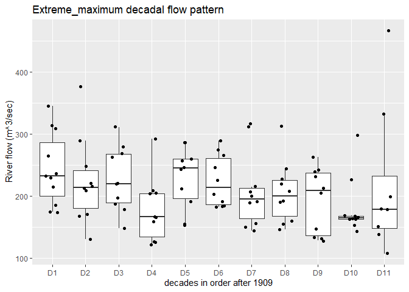
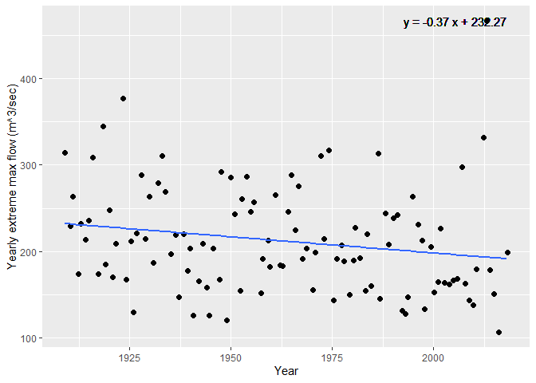

Mini Data Analysis Milestone 2
================
Gopal Khanal

- [Mini Data Analysis 2](#mini-data-analysis-2)
  - [Background information](#background-information)
  - [Instructions](#instructions)
  - [Learning Objectives](#learning-objectives)
- [Setup: Installing packages and loading
  libraries](#setup-installing-packages-and-loading-libraries)
- [Task 1: Process and summarize your
  data](#task-1-process-and-summarize-your-data)
  - [1.1 Re-writing the research questions mentioned in Milinestone 1 (1
    point)](#11-re-writing-the-research-questions-mentioned-in-milinestone-1-1-point)
  - [1.2 Summarizing and visualizing the data (8
    points)](#12-summarizing-and-visualizing-the-data-8-points)
  - [1.3 Re-considering the research questions (2
    points)](#13-re-considering-the-research-questions-2-points)
- [Task 2: Tidy your data](#task-2-tidy-your-data)
  - [2.1 Check whether data is Tidy or Untidy. (2
    points)](#21-check-whether-data-is-tidy-or-untidy-2-points)
  - [2.3 Pick Final Research Questions and Explain Your Decision (4
    points)](#23-pick-final-research-questions-and-explain-your-decision-4-points)
- [Task 3: Modelling](#task-3-modelling)
  - [3.0 Define the Independent Variable (no points) (no
    points)](#30-define-the-independent-variable-no-points-no-points)
  - [3.1 Fit the model (3 points)](#31-fit-the-model-3-points)
  - [3.2 Show results from the fitted models (3
    points)](#32-show-results-from-the-fitted-models-3-points)
- [Task 4: Reading and writing data](#task-4-reading-and-writing-data)
  - [4.1 Write a CSV file in the output folder (3
    points)](#41-write-a-csv-file-in-the-output-folder-3-points)
  - [4.2 Save model objects in the folder (3
    points)](#42-save-model-objects-in-the-folder-3-points)
- [Overall Reproducibility/Cleanliness/Coherence
  Checklist](#overall-reproducibilitycleanlinesscoherence-checklist)
  - [Coherence (0.5 points)](#coherence-05-points)
  - [File and folder structure (1
    points)](#file-and-folder-structure-1-points)
  - [Output (1 point)](#output-1-point)
  - [Tagged release (0.5 point)](#tagged-release-05-point)

*To complete this milestone, you can either edit [this `.rmd`
file](https://raw.githubusercontent.com/UBC-STAT/stat545.stat.ubc.ca/master/content/mini-project/mini-project-2.Rmd)
directly. Fill in the sections that are commented out with
`<!--- start your work here--->`. When you are done, make sure to knit
to an `.md` file by changing the output in the YAML header to
`github_document`, before submitting a tagged release on canvas.*

# Mini Data Analysis 2

## Background information

In Milestone 1, you explored your data. and came up with research
questions. This time, we will finish up our mini data analysis and
obtain results for your data by:

- Making summary tables and graphs
- Manipulating special data types in R: factors and/or dates and times.
- Fitting a model object to your data, and extract a result.
- Reading and writing data as separate files.

We will also explore more in depth the concept of *tidy data.*

**NOTE**: The main purpose of the mini data analysis is to integrate
what you learn in class in an analysis. Although each milestone provides
a framework for you to conduct your analysis, it’s possible that you
might find the instructions too rigid for your data set. If this is the
case, you may deviate from the instructions – just make sure you’re
demonstrating a wide range of tools and techniques taught in this class.

## Instructions

**To complete this milestone**, edit [this very `.Rmd`
file](https://raw.githubusercontent.com/UBC-STAT/stat545.stat.ubc.ca/master/content/mini-project/mini-project-2.Rmd)
directly. Fill in the sections that are tagged with
`<!--- start your work here--->`.

**To submit this milestone**, make sure to knit this `.Rmd` file to an
`.md` file by changing the YAML output settings from
`output: html_document` to `output: github_document`. Commit and push
all of your work to your mini-analysis GitHub repository, and tag a
release on GitHub. Then, submit a link to your tagged release on canvas.

**Points**: This milestone is worth 50 points: 45 for your analysis, and
5 for overall reproducibility, cleanliness, and coherence of the Github
submission.

**Research Questions**: In Milestone 1, you chose two research questions
to focus on. Wherever realistic, your work in this milestone should
relate to these research questions whenever we ask for justification
behind your work. In the case that some tasks in this milestone don’t
align well with one of your research questions, feel free to discuss
your results in the context of a different research question.

## Learning Objectives

By the end of this milestone, you should:

- Understand what *tidy* data is, and how to create it using `tidyr`.
- Generate a reproducible and clear report using R Markdown.
- Manipulating special data types in R: factors and/or dates and times.
- Fitting a model object to your data, and extract a result.
- Reading and writing data as separate files.

# Setup: Installing packages and loading libraries

I’ll be using following library and packages for this analysis.

``` r
library(datateachr) # <- This  contains that the data flow sample I'm using
library(tidyverse)
library(here)
library(broom)
library(readr)
```

# Task 1: Process and summarize your data

From milestone 1, you should have an idea of the basic structure of your
dataset (e.g. number of rows and columns, class types, etc.). Here, we
will start investigating your data more in-depth using various data
manipulation functions.

## 1.1 Re-writing the research questions mentioned in Milinestone 1 (1 point)

First, write out the 4 research questions you defined in milestone 1
were. This will guide your work through milestone 2:

<!-------------------------- Start your work below ---------------------------->

Q1: Whether there there is statistically significant trend in both
extreme minimum, and extreme maximum flow (m3/sec) over the years?

Q2: Compare flow pattern among decades:whether there are some decades
(say 1970-1980) with unusual extreme min and max flow?

Q3: Are flow patterns consistent across years with regards to months? Or
has there been any shift in months which has highest extreme maximum
flow or min flow?

Q4: Which months have extreme min and extreme max flow? Whether
particular months have unusually high extreme max flow over the years ?

<!----------------------------------------------------------------------------->

Here, we will investigate your data using various data manipulation and
graphing functions.

## 1.2 Summarizing and visualizing the data (8 points)

Now, for each of your four research questions, choose one task from
options 1-4 (summarizing), and one other task from 4-8 (graphing). You
should have 2 tasks done for each research question (8 total). Make sure
it makes sense to do them! (e.g. don’t use a numerical variables for a
task that needs a categorical variable.). Comment on why each task helps
(or doesn’t!) answer the corresponding research question.

Ensure that the output of each operation is printed!

Also make sure that you’re using dplyr and ggplot2 rather than base R.
Outside of this project, you may find that you prefer using base R
functions for certain tasks, and that’s just fine! But part of this
project is for you to practice the tools we learned in class, which is
dplyr and ggplot2.

**Summarizing:**

1.  Compute the *range*, *mean*, and *two other summary statistics* of
    **one numerical variable** across the groups of **one categorical
    variable** from your data.
2.  Compute the number of observations for at least one of your
    categorical variables. Do not use the function `table()`!
3.  Create a categorical variable with 3 or more groups from an existing
    numerical variable. You can use this new variable in the other
    tasks! *An example: age in years into “child, teen, adult, senior”.*
4.  Compute the proportion and counts in each category of one
    categorical variable across the groups of another categorical
    variable from your data. Do not use the function `table()`!

**Graphing:**

6.  Create a graph of your choosing, make one of the axes logarithmic,
    and format the axes labels so that they are “pretty” or easier to
    read.
7.  Make a graph where it makes sense to customize the alpha
    transparency.

Using variables and/or tables you made in one of the “Summarizing”
tasks:

8.  Create a graph that has at least two geom layers.
9.  Create 3 histograms, with each histogram having different sized
    bins. Pick the “best” one and explain why it is the best.

Make sure it’s clear what research question you are doing each operation
for!

<!------------------------- Start your work below ----------------------------->

### Question wise summarizing and graphing

#### Question 1: Whether there there is statistically significant trend in both extreme minimum, and extreme maximum flow (m3/sec) over the years?

**Selected summary question**

**Compute the *range*, *mean*, and two other summary statistics of **one
numerical variable** across the groups of **one categorical variable**
from your data**

Description: In the flow sample data, one of the continuous variable is
**flow** (m3/sec) and the categorical variable is flow type or
**extreme_type** (extreme minimum, extreme maximum)

The descriptive summary doesn’t answer the Q1 explicitly, but it does
provide important information about the summary statistics of the
variables, which I’ll be using in the modeling section.

The summary statistics shows that the mean flow in *extreme_maximum*
level is 212.07 m3/sec whereas it is 6.27 m3/sec in *extreme_minimum*
level. This difference is likely because **extreme_type** represent
yearly *extreme_maximum* and yearly *extreme_min* flow at the station
where river flow was measured.

The more interesting aspect is that **flow** is also is highly variable.
In the **extreme_maximum level**, the range (107 m3/sec-466 m3/sec)
whereas it is 3.62 m3/sec- 8.44 m3/sec in **extreme_minimum level**. The
*extreme_min* is less variable as shown by the coefficient of variation
(15.37), which is less than for *extreme_max* (29.08).

``` r
# Calculate summary statistics of **flow** (continuous variable) across the flow **extreme_type**.

summary_stat <- flow_sample %>%
  group_by(extreme_type) %>%
  summarize(
    mean = mean(flow, na.rm = TRUE), 
    range = max(flow, na.rm=TRUE)-min(flow, na.rm=TRUE), 
    sd = sd(flow, na.rm=TRUE),
    min = min(flow, na.rm=TRUE), 
    max = max(flow, na.rm=TRUE),
    cv <- sd(flow, na.rm=T) / mean(flow, na.rm=T) * 100)
print(summary_stat)
```

    ## # A tibble: 2 × 7
    ##   extreme_type   mean  range     sd    min    max cv <- sd(flow, na.rm = T)/me…¹
    ##   <chr>         <dbl>  <dbl>  <dbl>  <dbl>  <dbl>                          <dbl>
    ## 1 maximum      212.   359    61.7   107    466                              29.1
    ## 2 minimum        6.27   4.82  0.965   3.62   8.44                           15.4
    ## # ℹ abbreviated name: ¹​`cv <- sd(flow, na.rm = T)/mean(flow, na.rm = T) * 100`

**Selected graphing question**

**Create a graph that has at least two geom layers**

The **flow_sample** data contains yearly **flow (m3/sec)** for
*extreme_maximum* and *extreme_minimum* category for the **year** from
*1909* to *2018*. So each each **year** has two observations
(extreme_max, extreme_min).

I’m plotting the **flow (m3/sec)** in relation to **year**.

In the **milestone 1** I found that the magnitude of **flow** can be
extremely different depending upon the flow category **extreme_type**
(extreme minimum vs extreme maximum), and it is not prudent to compare
over time flow variation between extreme_max and extreme_min categories,
because it will be obviously different. Instead, it’s better to filter
and assess whether any one category of extreme **flow** is increasing or
decreasing over the time period **year**.

Thus, I subset the original data **flow_sample** and created a new data
*flow_sample1A* which is flow data for **extreme_maximum** category, and
*flow_sample1B* data for **extreme_minimum** category.

This graphing helps answer the Q1 partly because it allows to visualize
the relationship between two variables, but I’ll do detail analysis in
the modeling section.

Here, I explored visualization of *extreme_max*, and *extreme_min* flow
type.

First, I explored the relationship between **flow** and **year** in the
*extreme_maximum* category. There appears to be *decreasing trend* over
the years (fig. plot_max).

Second, I explored the relationship between **flow** and **year** in the
extreme_minimum category. There appears to be *increasing trend* over
the years (fig. plot_min).

``` r
## plot 1 is recap of Milestone 1; flow variation over the years
## The difference is obvious based on extreme_type

plot_all<-flow_sample %>%
   ggplot(aes(x=year, y=flow)) +
   geom_point(aes(color = extreme_type))
print (plot_all)
```

    ## Warning: Removed 2 rows containing missing values (`geom_point()`).

<!-- -->

``` r
## Flow variation over the years for extreme_maximum category
## There appears to be decreasing trend in yearly maximum flow over the years
plot_max<-flow_sample %>% filter(extreme_type=="maximum") %>%
  ggplot(aes(year, flow)) +
  geom_point() +
  geom_smooth (method = "lm", se=FALSE)

## Flow variation over the years for extreme_minimum category
## There appears to be increasing trend in yearly maximum flow over the years
plot_min<-flow_sample %>% filter(extreme_type=="minimum") %>%
  ggplot(aes(year, flow)) +
  geom_point() +
  geom_smooth (method = "lm", se=FALSE)
```

**Important consideration**

While the flow in extreme_maximum category appears to be decreasing, and
increasing in the extreme_minimum category over the years , it would be
interesting to explore how above_average and below_average flows in both
categories are changing over the years.

Thus, I created a new categorical variable called **flow_pattern**,
which has two levels- **above_mean** for the years which has higher the
average flow of 109 years, and **below_mean** for the years which has
below the average flow of 109 years. I also created a new continuous
variable named **flow_change** which shows magnitude of difference
(m3/sec) to average flow of 109 years, and it could be positive,
negative and zero depending upon to what extent the flow of that year is
different than average flow of all years.

**flow_sample1A** is new dataset for *extreme_max* category

**flow_sample1B** is new dataset for *extreme_min* category

I explored how the *above_mean* and *below_mean* flow of both
extreme_maxim and extreme_min categories are changing over the years.

**Interesting finding:** While the overall flow showed decreasing trend
over the years in the **extreme_max** category (plot_max), the close
examination of flow variability shows that above_mean flow is increasing
over the years, whereas the below_mean flow is decreasing over the years
(plot1A). The increasing pattern in above_mean flow perhaps indicate
that the years with higher than average flow in extreme_maximum category
are increasing, which is alarming given the climate change impacts. In
simple words, this means that *above_mean* flow is occuring more
frequently over time.

In contrast, in **extreme_min** flow category, both the overall trend,
and *above_mean* and *below_mean* flows are increasing over the years,
albeit at small rate (plot_min, and plot1B)

``` r
# Create two new variables flow2 to quantify how much higher or lower is the flow in comparison to average flow
# Create a variable flow_pattern to quantify whether flow is above or below the average flow of 109 years

flow_sample1A <-flow_sample%>%
  filter(extreme_type =="maximum") %>%
  group_by(station_id)%>%
  arrange(year) %>%
  mutate(flow2 = flow-mean(flow), flow_pattern = factor(ifelse(flow > mean(flow), "above_mean", "below_mean"), levels=c("above_mean", "below_mean")))

head(flow_sample1A)
```

    ## # A tibble: 6 × 9
    ## # Groups:   station_id [1]
    ##   station_id  year extreme_type month   day  flow sym    flow2 flow_pattern
    ##   <chr>      <dbl> <chr>        <dbl> <dbl> <dbl> <chr>  <dbl> <fct>       
    ## 1 05BB001     1909 maximum          7     7   314 <NA>  102.   above_mean  
    ## 2 05BB001     1910 maximum          6    12   230 <NA>   17.9  above_mean  
    ## 3 05BB001     1911 maximum          6    14   264 <NA>   51.9  above_mean  
    ## 4 05BB001     1912 maximum          8    25   174 <NA>  -38.1  below_mean  
    ## 5 05BB001     1913 maximum          6    11   232 <NA>   19.9  above_mean  
    ## 6 05BB001     1914 maximum          6    18   214 <NA>    1.93 above_mean

``` r
## plot scatterplot of flow in relation to year and newly created variable flow pattern

plot1A<-flow_sample1A %>%
  ggplot(aes(x=year, y=flow, col=flow_pattern), rm.na=TRUE) +
  geom_point(position = "jitter", size=2) +
  geom_smooth(method = "lm", se = FALSE) +
  xlab("Year") +
  ylab("Yearly extreme flow (m^3/sec)")

plot1A
```

    ## `geom_smooth()` using formula = 'y ~ x'

<!-- -->

``` r
# Extreme minimum level

flow_sample1B <-flow_sample%>%
  filter(!is.na(flow)) %>%
  filter(extreme_type =="minimum") %>%
  group_by(station_id)%>%
  arrange(year) %>%
  mutate(flow2 = flow-mean(flow, na.rm=T), flow_pattern = factor(ifelse(flow > mean(flow, na.rm=T), "above_mean", "below_mean"), levels= c("above_mean", "below_mean")))


head(flow_sample1B)
```

    ## # A tibble: 6 × 9
    ## # Groups:   station_id [1]
    ##   station_id  year extreme_type month   day  flow sym    flow2 flow_pattern
    ##   <chr>      <dbl> <chr>        <dbl> <dbl> <dbl> <chr>  <dbl> <fct>       
    ## 1 05BB001     1911 minimum          2    27  5.75 <NA>  -0.524 below_mean  
    ## 2 05BB001     1912 minimum          3    14  5.8  <NA>  -0.474 below_mean  
    ## 3 05BB001     1913 minimum          3    18  6.12 B     -0.154 below_mean  
    ## 4 05BB001     1914 minimum         11    17  7.16 <NA>   0.886 above_mean  
    ## 5 05BB001     1915 minimum          1    27  6.94 <NA>   0.666 above_mean  
    ## 6 05BB001     1916 minimum          3     2  6.97 B      0.696 above_mean

``` r
## plot scatter plot of flow in relation to year and newly created variable flow pattern

plot1B<-flow_sample1B %>%
  ggplot(aes(x=year, y=flow, col=flow_pattern), rm.na=T) +
  geom_point(position = "jitter", size=2) +
  geom_smooth(method = "lm", se = FALSE) +
  xlab("Year") +
  ylab("Yearly extreme flow (m^3/sec)")

plot1B
```

    ## `geom_smooth()` using formula = 'y ~ x'

<!-- -->

#### Question 2: Compare flow pattern among decades:whether there are some decades (say 1970-1980) with unusual extreme min and max flow?

**Selected summary question**

\*\*Create a categorical variable with 3 or more groups from an existing
numerical variable. You can use this new variable in the other tasks!
\*An example: age in years into “child, teen, adult, senior”.\*\*

In the previous **data analysis 1**, I plotted flow vs year to assess
whether there has been any specific pattern over 109 years. I simply
plotted **flow** vs **year** without checking the whether there are any
decadal flow patterns. Climate change may cause decadal fluctuations in
flow. Thus, it makes sense to make a **year** as a categorical variable.
I created a new categorical variable **decade**. There are total 109
years which represents nearly 11 decades.

The new dataset is named as **flow_sample2_max** for *extreme_maximum*
category

The new dataset is named as **flow_sample2_min** for *extreme_minimum*
category

Creating new categorical variable partly helped answer my Q2 because it
provided basis for further statistical examination. For both
extreme_maximum and extreme_minimum category, there appears to be
decadal fluctuations in flow as shown by boxplots (plot2A, and plot 2B).
In particular, for *extreme_minimum* category, there seems to increasing
pattern in decadal pattern (fig. plot2A) whereas there is decreasing
trend in *extreme_maximum* category (fig. plot2A). But important thing
to note here that there is substantial uncertainty in the 11th decade of
*extreme_maximum* category where there is an outlier with flow (466
m3/sec) which is unusually higher than other observations in the same
decade.

``` r
# Create new categorical variable of year
# 11 levels from Decade 1 to Decade 11
# Plot decade wise flow over the 11 decades

## New data for extreme_maximum category

flow_sample2_max <- flow_sample1A %>%
  mutate(decade = case_when(
     year < 2020 & year >=2010~ "D11",
     year < 2010 & year>= 2000~ "D10",
     year < 2000 & year>= 1990 ~ "D9",
     year <1990 & year >=1980 ~"D8",
     year <1980 & year >=1970 ~ "D7",
     year < 1970 & year>=1960 ~"D6",
     year < 1960 & year>=1950 ~ "D5",
     year< 1950 & year >=1940 ~ "D4",
     year< 1940 & year>=1930 ~"D3",
     year<1930 & year >=1920 ~"D2",
     year<1920 & year >= 1909 ~ "D1"
  )) 


# Plot boxplot flow variation across decades for extreme_max category

plot2A<-ggplot(flow_sample2_max, aes(x= reorder(decade, year), y=flow)) +
  geom_boxplot(outlier.shape = NA) + geom_jitter(width = 0.2) +
  xlab("decades in order after 1909") +
  ylab(" River flow (m^3/sec)") +
  labs(title = "Extreme_maximum decadal flow pattern")
  
plot2A
```

<!-- -->

``` r
## New data for extreme_minimum category

flow_sample2_min <- flow_sample1B %>%
  mutate(decade = case_when(
     year < 2020 & year >=2010~ "D11",
     year < 2010 & year>= 2000~ "D10",
     year < 2000 & year>= 1990 ~ "D9",
     year <1990 & year >=1980 ~"D8",
     year <1980 & year >=1970 ~ "D7",
     year < 1970 & year>=1960 ~"D6",
     year < 1960 & year>=1950 ~ "D5",
     year< 1950 & year >=1940 ~ "D4",
     year< 1940 & year>=1930 ~"D3",
     year<1930 & year >=1920 ~"D2",
     year<1920 & year >= 1909 ~ "D1"
  )) 


# Create boxplot for flow variation across decades for extreme_minimum category

plot2B<-ggplot(flow_sample2_min, aes(x= reorder(decade, year), y=flow)) +
  geom_boxplot(outlier.shape = NA) + geom_jitter(width = 0.2) +
  xlab("decades in order after 1909") +
  ylab(" River flow (m^3/sec)") +
  labs(title = "Extreme_minimum decadal flow pattern")

plot2B
```

<!-- -->

**Selected graphing question**\*

**Create 3 histograms, with each histogram having different sized bins.
Pick the “best” one and explain why it is the best.**

Because histogram comparison doesn’t make much sense to answer my Q2
decade wise pattern analysis and my other questions from Q1-Q4, I chose
to check the frequency of flow (numeric variable). This is to assess
whether particular flow magnitude is repeated over years or has high
frequency of occurence.

In the flow sample dataset, **flow (m3/sec)** is the only sensible
variable to plot the frequency of distribution. The variable **month**
doesn’t have much repeated observations across all 12 months (limited to
only different 6 months), and years from 1909-2018 has just two
observation per **year**.

Therefore, I chose the flow (continuous variable) to plot histograms
with different bin size.

Because the flow variable is numeric with repeated values have limited
difference in magnitude, I think the small bin size (histogram no 1 with
10 unit bin size) would be better than the histogram 2 with 30 bin size
and histogram 3 with 50 bin size.

For this task, I used **flow_sample1A** data because there is good
amount of variability in the continuous variable **flow** in
extreme_maxmimum category (range:107 m3/sec-466 m3/sec) whereas the
exteme_minimum data is too less variable to compare effect of bin width
on visualization (range: 3.62 m3/sec- 8.44 m3/sec)

Because the \*flow”\*\* ranges from 07 m3/sec to 466 m3/sec, I created
three histograms of different bin sizes (10,30, 100 ). These histograms
shows the frequency of different magnitudes of flow that occured in 109
years from 1909-2018.

Out of three bin sizes, I found the bin size of 20 is most appealing as
well as informative to visualize the frequency of flow. In 100 bin
width, much of the information is lost, because the region of flow
between 150m3/sec-250 m3/sec is not well represented, whereas using too
small bin size of 5 will show much clutter and doesn’t look intuitive
enough to visualize and extract information. The bin width of 20 looks a
good compromise.

**Histogram 1 of bin size 5**

``` r
# Histogram 1 with bin width 5
 histogram1<-ggplot(flow_sample1A,aes(flow)) +
         geom_histogram(alpha=1, fill= "pink", color= "blue", binwidth = 5) +
        labs(title = "Histogram for flow", x = "Flow (m3/sec)", y = "Frequency") +
    theme_minimal() +
  theme(plot.title = element_text(hjust = 0.5))

  print(histogram1)
```

<!-- -->

**Histogram 2 of bin size 20**

``` r
# Histogram 1 with bin width 20
  
  histogram2<-ggplot(flow_sample1A,aes(flow)) +
    geom_histogram(alpha=0.8, fill= "pink", color= "blue", binwidth = 20) +
    labs(title = "Histogram for flow", x = "Flow (m3/sec)", y = "Frequency") +
    theme_minimal() +
  theme(plot.title = element_text(hjust = 0.5))
  
 print(histogram2)
```

<!-- -->

**Histogram 3 of bin size 100**

``` r
 # Histogram 3 with bin width 100
  
  histogram3<-ggplot(flow_sample1A,aes(flow)) +
    geom_histogram(alpha=0.8, fill= "pink", color= "blue", binwidth = 100) +
    labs(title = "Histogram for flow", x = "Flow (m3/sec)", y = "Frequency") +
    theme_minimal() +
  theme(plot.title = element_text(hjust = 0.5))
  
  print(histogram3)
```

<!-- -->

#### Question 3: Are flow patterns consistent across years with regards to months? Or has there been any shift in months which has highest extreme maximum flow or min flow?

**Selected summary question**\*

**Compute the number of observations for at least one of your
categorical variables. Do not use the function `table()`!**

In my original dataset, there was only one categorical variable
(extreme_type) and there were two levels (maximum, minimum) and both
levels had same 109 observations. So it is not appealing to explore the
number of observations in the **year**.

Therefore I decided to work with new categorical variable **flow
pattern**, which has two level (above_mean and below_mean) corresponding
to whether the extreme_maximumyearly flow in the river is higher than
the average flow of 109 years or below the average of 109 years.

I used **flow_sample1A** and **flow_sample1B** data.

**Interesting finding**:

In both extreme_max and extreme_min categories,there are fewer years
with above_mean flow than below_mean flow. In extreme_max, 47 years had
the above_mean flow and 62 years ha below_min flow, and in the
extreme_min category, 49 years had the above_mean flow and 58 years had
below_min flow. From this data, it can be inferred that there are some
years with unusually high or low flow that is driving the annual
fluctuations in flow over the years. For example, the year 2013 had
unusually high flow in the *extreme_max* category (466 m3/sec), and 1932
had low flow in *extreme_min* category (3.62 m3/sec). But important
thing to note here is that **flow (m3/sec)** less variable across years
in extreme_min category than extreme_max category as indicated by their
coefficient of variation.

It would be interesting to explore with which years are those that have
above average flows.

``` r
## No of years (n) where flow is above_mean and below_mean in extreme_max category
No.of.obs_max<- flow_sample1A %>%
  filter(!is.na(flow_pattern)) %>%
  count(flow_pattern) %>%
  arrange(desc(n))
print(No.of.obs_max)
```

    ## # A tibble: 2 × 3
    ## # Groups:   station_id [1]
    ##   station_id flow_pattern     n
    ##   <chr>      <fct>        <int>
    ## 1 05BB001    below_mean      62
    ## 2 05BB001    above_mean      47

``` r
## No of years (n) where flow is above_mean and below_mean in extreme_min category
No.of.obs_min<- flow_sample1B %>%
  filter(!is.na(flow_pattern)) %>%
  count(flow_pattern) %>%
  arrange(desc(n))
print(No.of.obs_min)
```

    ## # A tibble: 2 × 3
    ## # Groups:   station_id [1]
    ##   station_id flow_pattern     n
    ##   <chr>      <fct>        <int>
    ## 1 05BB001    below_mean      58
    ## 2 05BB001    above_mean      49

**Selected graphing question**\* **Create a graph of your choosing, make
one of the axes logarithmic, and format the axes labels so that they are
“pretty” or easier to read.**

This graphing question does not help answer anyone of my questions
Q1-Q4, but it does help in better visualization of the numeric variable
of flow sample data.

In flow sample dataset of extreme_max category **flow_sample1A**, the
main numerical variable (flow) doesn’t have extreme range. This means
doing logartihmic transformation of one axis and plot it on log scale
won’t be very useful. But for a practice, I’ve plotted log10 of flow in
the y-axis vs year in the x-axis.

``` r
## Plotting flow vs year 
plot_log <- ggplot(data=flow_sample1A, aes(x=year, y=flow)) +
  geom_point() +
  scale_y_log10("flow (m3/sec") + ##log transformation
  theme_minimal()+
  xlab("Year") +
  labs(title="Flow variation across 109 years") +
    theme(plot.title = element_text(hjust = 0.5))

print(plot_log)
```

<!-- -->

#### Question 4: Which months have extreme min and extreme max flow? Whether particular months have unusually high extreme max flow over the years ?

**Selected summary question**\*

**Compute the proportion and counts in each category of one categorical
variable across the groups of another categorical variable from your
data. Do not use the function `table()`!**

I calculated whether particular months had more number of years with
higher than overall average flow for both category of extreme_types.

The results shows that for extreme_max category, the month 6 (June) has
the highest number of years (40 years) with *above_mean* flows, and same
month (June) has highest number of years with *below_mean* flows. This
is surprising because the month **June** has both highest and lowest
flows in extreme_max category indicating that this month is highly
variable in flow.

In *extreme_min* category, the number of years with above_mean and
below_mean flow are less variable than in *extreme_max* category. The
number of years with above_mean and below_mean flow are more or less
evenly distributed in the Month 2 and 3 (Feb & March).

``` r
## Organizing months for extreme_max category with flows that are above the mean and below the mean flow
months_max <-flow_sample2_max %>%
  group_by(month, flow_pattern) %>%
  summarize( 
    count=n(),
    proportions = n()/ nrow(flow_sample2_max)
  ) %>%
  arrange(desc(count))
```

    ## `summarise()` has grouped output by 'month'. You can override using the
    ## `.groups` argument.

``` r
print(months_max)
```

    ## # A tibble: 7 × 4
    ## # Groups:   month [4]
    ##   month flow_pattern count proportions
    ##   <dbl> <fct>        <int>       <dbl>
    ## 1     6 above_mean      40     0.367  
    ## 2     6 below_mean      39     0.358  
    ## 3     5 below_mean      13     0.119  
    ## 4     7 below_mean       9     0.0826 
    ## 5     7 above_mean       4     0.0367 
    ## 6     5 above_mean       3     0.0275 
    ## 7     8 below_mean       1     0.00917

``` r
## Organizing the months for extreme_min with flows that are above the mean and below the mean flow
months_min <-flow_sample2_min %>%
  group_by(month, flow_pattern) %>%
  summarize( 
    count=n(),
    proportions = n()/ nrow(flow_sample2_min)
  ) %>%
  arrange(desc(count))
```

    ## `summarise()` has grouped output by 'month'. You can override using the
    ## `.groups` argument.

``` r
print(months_min)
```

    ## # A tibble: 12 × 4
    ## # Groups:   month [6]
    ##    month flow_pattern count proportions
    ##    <dbl> <fct>        <int>       <dbl>
    ##  1     3 above_mean      20     0.187  
    ##  2     3 below_mean      17     0.159  
    ##  3     2 below_mean      16     0.150  
    ##  4     2 above_mean      12     0.112  
    ##  5    12 below_mean      10     0.0935 
    ##  6     1 above_mean       9     0.0841 
    ##  7     1 below_mean       6     0.0561 
    ##  8     4 below_mean       5     0.0467 
    ##  9    11 below_mean       4     0.0374 
    ## 10    12 above_mean       4     0.0374 
    ## 11     4 above_mean       3     0.0280 
    ## 12    11 above_mean       1     0.00935

**Selected graphing question**\*

**Make a graph where it makes sense to customize the alpha
transparency.**

To align with my Q4 (figuring out months that have extreme min and
extreme max flow), I created a scatter plot for both extreme_max
(fig. plot4A), and extreme_min category (fig. plot4B). Here, use of
alpha transparency does not make much sense because the function color
can help distinguish the pattern. But it does help me answer Q4 partly.

This graphing shows that above_mean flows in the extreme_max category
are largely concentrated in the month 6 (June) whereas both above_mean
and below_mean flows for extreme_min category are more or less even
distributed across Month 2 and 3 (Feb and March).

``` r
## Create scatter plot for flow vs months for extreme_max

plot4A<-ggplot(flow_sample2_max, aes(month, flow, color=flow_pattern)) +
  geom_point() +
theme_minimal()+
  xlab("Month") +
  ylab("Flow")+
  labs(title="Month wise flow pattern for extreme_max flow")
print(plot4A)
```

<!-- -->

``` r
## Create scatter plot for flow vs months for extreme_min

plot4B<-ggplot(flow_sample2_min, aes(month, flow, color=flow_pattern)) +
  geom_point() +
theme_minimal()+
  xlab("Month") +
  ylab("Flow (m3/sec")+
  labs(title="Month wise flow pattern for extreme_min flow")
print(plot4B)
```

<!-- -->

To make sense of alpha transparency, I created another plot where
created a density plot for **flow** and customized the alpha
transparency so that visualization of region where average flow between
two levels of flow_patterns(above_mean and below_mean) overlaps.

The results (plot) shows that flow between 170m3/sec - 240m3/sec
overlaps, and that region corresponds to average flows in both levels.

``` r
flow_sample2_max %>% #select data set
  ggplot(aes(x=flow))+ #select flow as the continuous variable on the x-axis
  geom_density(aes(fill=flow_pattern),na.rm=TRUE,alpha=0.5)+ #colour according to the value of flow_pattern (above_mean/below_mean)
  guides(fill=guide_legend(title="Flow_pattern"))+ #specify colour legend title
  xlab("Flow (m3/sec)")+
  ylab("Density")+
  theme_minimal()
```

<!-- -->

<!----------------------------------------------------------------------------->

## 1.3 Re-considering the research questions (2 points)

Based on the operations that you’ve completed, how much closer are you
to answering your research questions? Think about what aspects of your
research questions remain unclear. Can your research questions be
refined, now that you’ve investigated your data a bit more? Which
research questions are yielding interesting results?

<!------------------------- Write your answer here ---------------------------->

I think the the summarizing and graphing questions partially helped
answer my questions, because the main findings of my questions Q1-Q4
will be inconclusive without statistical tests.

Below, I summarize progress and things that remained unclear.

**Q1: Whether there there is statistically significant trend in both
extreme minimum, and extreme maximum flow (m3/sec) over the years?**

Based on graphing results, it appears that there are trends in flow over
the years, with *extreme_maximum* flow slightly decreasing over the
years, and *extreme_minimum* flow slightly increasing over the years.
The closer examination of *above_mean* or *below_mean* flow patterns
revealed that in the *extreme_max* category, the *above_mean* flows are
increasing and *below_mean* flow are decreasing whereas both
*above_mean* and *below_mean* flows are consistently increasing over the
years in the *extreme_min* category.

I think statistical tests need to done to confirm whether these patterns
are statistically significant.

**Q2: Compare flow pattern among decades:whether there are some decades
(say 1970-1980) with unusual extreme min and max flow? Which years had
more than average of extreme maximum flow?**

I compared whether flow patterns in both extreme_max and extreme_min
flow categories are associated with decades (decade 1 to decade 11).
Overall, there is a lot of inter-decadal heterogeneity in flow in both
categories, and thus it is difficult to ascertain whether there is
statistically significant decadal patterns in the flow without formal
statistical test. But one thing is noticeable- it is that the flows in
*extreme_max* categories are highly variable with lots of within decade
and inter-decade variation than *extreme_min* categories as shown in
figures plot2A and plot2B.

I think next step would be do a statistical test (e.g. ANOVA) to assess
whether mean flow across decades are statistically different.

**Q3: Are flow patterns consistent across years with regards to months?
Or has there been any shift in months which has highest extreme maximum
flow or min flow?**

This question was not properly answered by above tasks. While the
monthly flow pattern across years couldn’t be ascertained properly, I
did try to check how many years out of total 109 years, had the
*above_mean* and *below_mean* flows for both categories (extreme_max,
and extreme_min).

In both extreme_max and extreme_min categories,there are fewer years
with above_mean flow than below_mean flow. In extreme_max, 47 years had
the above_mean flow and 62 years ha below_min flow, and in the
extreme_min category, 49 years had the above_mean flow and 58 years had
below_min flow.

From this data, it can be inferred that there are some years with
unusually high or low flow that is driving the annual fluctuations in
flow over the years. For example, the year 2013 had unusually high flow
in extreme_max category (466 m3/sec), and 1932 had low flow in
extreme_min category (3.62 m3/sec). But important thing to note here is
that **flow (m3/sec)** less variable across years in extreme_min
category than extreme_max category as indicated by their CV.

Now, it would be interesting to explore further to understand whether
there has there been any shift in months(e.g., June vs July) with
regards to extreme_maximum and extreme_minimum flow?

**Q4: Which months have extreme min and extreme max flow? Whether
particular months have unusually high extreme max flow over the years
?**

This question was partly answered by above tasks.

I calculated whether particular months had more number of years with
higher than overall average flow for both category of extreme_types.

The results shows that for *extreme_max* category, the month 6
**(June)** has the highest number of years (40 years) with *above_mean*
flows, and same month (June) has highest number of years with
*below_mean* flows. This is surprising because the month **June** has
both highest and lowest flows in extreme_max category indicating that
this month is highly variable in flow. In *extreme_min* category, the
number of years with above_mean and below_mean flow are less variable
than in extreme_max category. The number of years with above_mean and
below_mean flow are more or less evenly distributed in the Month 2 and 3
(Feb & March).

I created scatter plots for both extreme_max (fig. plot4A), and
extreme_min category (fig. plot4B) to visualize the patterns. Overall,
it looks like that above_mean flows in the extreme_max category are
largely concentrated in the month 6 (June) whereas both above_mean and
below_mean flows for extreme_min category are more or less even
distributed across Month 2 and 3 (Feb and March).

Now, it would be interesting to explore further understand why the month
June so much variable in respect to above_mean and below_mean flows.

<!----------------------------------------------------------------------------->

# Task 2: Tidy your data

In this task, we will do several exercises to reshape our data. The goal
here is to understand how to do this reshaping with the `tidyr` package.

A reminder of the definition of *tidy* data:

- Each row is an **observation**
- Each column is a **variable**
- Each cell is a **value**

## 2.1 Check whether data is Tidy or Untidy. (2 points)

Based on the definition above, can you identify if your data is tidy or
untidy? Go through all your columns, or if you have \>8 variables, just
pick 8, and explain whether the data is untidy or tidy.

### Checking tidiness of flow sample data

Overall, my **flow_sample** data looks tidy for my analysis, but again
depending on purpose of its analysis, it can be untidy data as well
because there missing values for the year 1909 and 1910, and there are
199 missing values for the variable named **sym**. The flow variable
value is missing for the year 1909 and 1910 for the extreme_minimum flow
category

Overall, the data is tidy because each rows contains one single
observation about flow of particular station ID in the river, and
associated features (year of data collection, whether the measurement
was extreme_max or extreme_min, day, and month of measurement).This
means the data has each row as an observation, each column as a
variable, and each cell as a value.

<!--------------------------- Start your work below --------------------------->

- Based on the below investigation, I have determined that my dataset
  adheres to the principles of a tidy dataset.
- Each row serves as an individual observation, without any duplicate
  measurements.
- Each column represents a distinct variable, and there are no absent
  values, as every cell contains data.

``` r
### Assessment of tidiness of data

tidy_stat<-glimpse(flow_sample)
```

    ## Rows: 218
    ## Columns: 7
    ## $ station_id   <chr> "05BB001", "05BB001", "05BB001", "05BB001", "05BB001", "0…
    ## $ year         <dbl> 1909, 1910, 1911, 1912, 1913, 1914, 1915, 1916, 1917, 191…
    ## $ extreme_type <chr> "maximum", "maximum", "maximum", "maximum", "maximum", "m…
    ## $ month        <dbl> 7, 6, 6, 8, 6, 6, 6, 6, 6, 6, 6, 7, 6, 6, 6, 7, 5, 7, 6, …
    ## $ day          <dbl> 7, 12, 14, 25, 11, 18, 27, 20, 17, 15, 22, 3, 9, 5, 14, 5…
    ## $ flow         <dbl> 314, 230, 264, 174, 232, 214, 236, 309, 174, 345, 185, 24…
    ## $ sym          <chr> NA, NA, NA, NA, NA, NA, NA, NA, NA, NA, NA, NA, NA, NA, N…

``` r
print(tidy_stat)
```

    ## # A tibble: 218 × 7
    ##    station_id  year extreme_type month   day  flow sym  
    ##    <chr>      <dbl> <chr>        <dbl> <dbl> <dbl> <chr>
    ##  1 05BB001     1909 maximum          7     7   314 <NA> 
    ##  2 05BB001     1910 maximum          6    12   230 <NA> 
    ##  3 05BB001     1911 maximum          6    14   264 <NA> 
    ##  4 05BB001     1912 maximum          8    25   174 <NA> 
    ##  5 05BB001     1913 maximum          6    11   232 <NA> 
    ##  6 05BB001     1914 maximum          6    18   214 <NA> 
    ##  7 05BB001     1915 maximum          6    27   236 <NA> 
    ##  8 05BB001     1916 maximum          6    20   309 <NA> 
    ##  9 05BB001     1917 maximum          6    17   174 <NA> 
    ## 10 05BB001     1918 maximum          6    15   345 <NA> 
    ## # ℹ 208 more rows

``` r
# Check for duplicates in a "year" column
duplicates <- duplicated(flow_sample$year)
print(duplicates)
```

    ##   [1] FALSE FALSE FALSE FALSE FALSE FALSE FALSE FALSE FALSE FALSE FALSE FALSE
    ##  [13] FALSE FALSE FALSE FALSE FALSE FALSE FALSE FALSE FALSE FALSE FALSE FALSE
    ##  [25] FALSE FALSE FALSE FALSE FALSE FALSE FALSE FALSE FALSE FALSE FALSE FALSE
    ##  [37] FALSE FALSE FALSE FALSE FALSE FALSE FALSE FALSE FALSE FALSE FALSE FALSE
    ##  [49] FALSE FALSE FALSE FALSE FALSE FALSE FALSE FALSE FALSE FALSE FALSE FALSE
    ##  [61] FALSE FALSE FALSE FALSE FALSE FALSE FALSE FALSE FALSE FALSE FALSE FALSE
    ##  [73] FALSE FALSE FALSE FALSE FALSE FALSE FALSE FALSE FALSE FALSE FALSE FALSE
    ##  [85] FALSE FALSE FALSE FALSE FALSE FALSE FALSE FALSE FALSE FALSE FALSE FALSE
    ##  [97] FALSE FALSE FALSE FALSE FALSE FALSE FALSE FALSE FALSE FALSE FALSE FALSE
    ## [109] FALSE  TRUE  TRUE  TRUE  TRUE  TRUE  TRUE  TRUE  TRUE  TRUE  TRUE  TRUE
    ## [121]  TRUE  TRUE  TRUE  TRUE  TRUE  TRUE  TRUE  TRUE  TRUE  TRUE  TRUE  TRUE
    ## [133]  TRUE  TRUE  TRUE  TRUE  TRUE  TRUE  TRUE  TRUE  TRUE  TRUE  TRUE  TRUE
    ## [145]  TRUE  TRUE  TRUE  TRUE  TRUE  TRUE  TRUE  TRUE  TRUE  TRUE  TRUE  TRUE
    ## [157]  TRUE  TRUE  TRUE  TRUE  TRUE  TRUE  TRUE  TRUE  TRUE  TRUE  TRUE  TRUE
    ## [169]  TRUE  TRUE  TRUE  TRUE  TRUE  TRUE  TRUE  TRUE  TRUE  TRUE  TRUE  TRUE
    ## [181]  TRUE  TRUE  TRUE  TRUE  TRUE  TRUE  TRUE  TRUE  TRUE  TRUE  TRUE  TRUE
    ## [193]  TRUE  TRUE  TRUE  TRUE  TRUE  TRUE  TRUE  TRUE  TRUE  TRUE  TRUE  TRUE
    ## [205]  TRUE  TRUE  TRUE  TRUE  TRUE  TRUE  TRUE  TRUE  TRUE  TRUE  TRUE  TRUE
    ## [217]  TRUE  TRUE

``` r
# Calculate the total number of missing values in each column
missing_values <- colSums(is.na(flow_sample))
# Print missing values
print(missing_values)
```

    ##   station_id         year extreme_type        month          day         flow 
    ##            0            0            0            2            2            2 
    ##          sym 
    ##          119

<!----------------------------------------------------------------------------->

### 2.2 Make the tidy data untidy (4 points)

Now, if your data is tidy, untidy it! Then, tidy it back to it’s
original state.

If your data is untidy, then tidy it! Then, untidy it back to it’s
original state.

Be sure to explain your reasoning for this task. Show us the “before”
and “after”.

<!--------------------------- Start your work below --------------------------->

After all, the tidiness of the data depends upon the intended analysis.
Making tidy data untidy or vice versa requires changing shape
(dimensions) of data or creating redundancy in data.

**Part 1**

My **flow_sample** was mostly tidy for my purpose of analysis. So I’m
making it untidy. The current tidy format includes years months in one
column **month** so that each observation in separate months go into
separate rows.

To make it untidy, I want to create months as separate columns and
observation will be listed in respective rows. For example, for the
month that has no flow measurement, there will be no observation for
that month, but it untidying will create blank or NA cell value. This
will introduce a lot of redundancy because column numbers will increase
as will number of cells without actual observation/value.

**The untidy has 15 variables, and the tidy data has 7 variables**

``` r
## Make the data wider 
untidy_flow1 <- flow_sample %>%
  filter(!is.na(flow)) %>% # Remove the rows which has no flow value
  pivot_wider(names_from = month,
              values_from = flow)

# Print the untidy data
print(untidy_flow1)
```

    ## # A tibble: 216 × 15
    ##    station_id  year extreme_type   day sym     `7`   `6`   `8`   `5`   `2`   `3`
    ##    <chr>      <dbl> <chr>        <dbl> <chr> <dbl> <dbl> <dbl> <dbl> <dbl> <dbl>
    ##  1 05BB001     1909 maximum          7 <NA>    314    NA    NA    NA    NA    NA
    ##  2 05BB001     1910 maximum         12 <NA>     NA   230    NA    NA    NA    NA
    ##  3 05BB001     1911 maximum         14 <NA>     NA   264    NA    NA    NA    NA
    ##  4 05BB001     1912 maximum         25 <NA>     NA    NA   174    NA    NA    NA
    ##  5 05BB001     1913 maximum         11 <NA>     NA   232    NA    NA    NA    NA
    ##  6 05BB001     1914 maximum         18 <NA>     NA   214    NA    NA    NA    NA
    ##  7 05BB001     1915 maximum         27 <NA>     NA   236    NA    NA    NA    NA
    ##  8 05BB001     1916 maximum         20 <NA>     NA   309    NA    NA    NA    NA
    ##  9 05BB001     1917 maximum         17 <NA>     NA   174    NA    NA    NA    NA
    ## 10 05BB001     1918 maximum         15 <NA>     NA   345    NA    NA    NA    NA
    ## # ℹ 206 more rows
    ## # ℹ 4 more variables: `11` <dbl>, `1` <dbl>, `4` <dbl>, `12` <dbl>

``` r
## Make the untidy data tidy

## I use the pivot_longer to make the data tidy 
## This makes the data longer as in the original data

tidy_flow1 <- untidy_flow1 %>%
  pivot_longer(
    cols = -c(station_id, year, extreme_type, day, sym),
    names_to = "month", 
    values_to = "flow",
    values_drop_na = TRUE
  )

# Compare tidy data and original data.

print(tidy_flow1)
```

    ## # A tibble: 216 × 7
    ##    station_id  year extreme_type   day sym   month  flow
    ##    <chr>      <dbl> <chr>        <dbl> <chr> <chr> <dbl>
    ##  1 05BB001     1909 maximum          7 <NA>  7       314
    ##  2 05BB001     1910 maximum         12 <NA>  6       230
    ##  3 05BB001     1911 maximum         14 <NA>  6       264
    ##  4 05BB001     1912 maximum         25 <NA>  8       174
    ##  5 05BB001     1913 maximum         11 <NA>  6       232
    ##  6 05BB001     1914 maximum         18 <NA>  6       214
    ##  7 05BB001     1915 maximum         27 <NA>  6       236
    ##  8 05BB001     1916 maximum         20 <NA>  6       309
    ##  9 05BB001     1917 maximum         17 <NA>  6       174
    ## 10 05BB001     1918 maximum         15 <NA>  6       345
    ## # ℹ 206 more rows

``` r
# original data
original_data <- flow_sample %>%
  filter(!is.na(flow)) 

print(original_data)
```

    ## # A tibble: 216 × 7
    ##    station_id  year extreme_type month   day  flow sym  
    ##    <chr>      <dbl> <chr>        <dbl> <dbl> <dbl> <chr>
    ##  1 05BB001     1909 maximum          7     7   314 <NA> 
    ##  2 05BB001     1910 maximum          6    12   230 <NA> 
    ##  3 05BB001     1911 maximum          6    14   264 <NA> 
    ##  4 05BB001     1912 maximum          8    25   174 <NA> 
    ##  5 05BB001     1913 maximum          6    11   232 <NA> 
    ##  6 05BB001     1914 maximum          6    18   214 <NA> 
    ##  7 05BB001     1915 maximum          6    27   236 <NA> 
    ##  8 05BB001     1916 maximum          6    20   309 <NA> 
    ##  9 05BB001     1917 maximum          6    17   174 <NA> 
    ## 10 05BB001     1918 maximum          6    15   345 <NA> 
    ## # ℹ 206 more rows

**Part 2:**

I’m widening the column numbers. The categorical variable
**extreme_type** has two levels, so after untidying those two levels
will now have separate columns and they will be separate variables.
While the column number is same (7) because the numeric variable flow
will be distributed into two columns **maximum** and **minimum**. The
issue with this untidy data is the flow variable (value) was shifted in
separate cell, and there will be NA’s (when one variable gets value,
other variable will have NAs) making it difficult to do some statistical
analysis and visualization, and do vector operations, and data
manipulations for the flow variable.

``` r
## Make the data wider so that categorical variable extreme_type is widened
#into two variables based on it level
# Value comes from the variable flow
untidy_flow2 <- flow_sample %>%
  filter(!is.na(flow)) %>%
  pivot_wider(names_from = extreme_type,
              values_from = flow)

# Print the untidy data
print(untidy_flow2)
```

    ## # A tibble: 216 × 7
    ##    station_id  year month   day sym   maximum minimum
    ##    <chr>      <dbl> <dbl> <dbl> <chr>   <dbl>   <dbl>
    ##  1 05BB001     1909     7     7 <NA>      314      NA
    ##  2 05BB001     1910     6    12 <NA>      230      NA
    ##  3 05BB001     1911     6    14 <NA>      264      NA
    ##  4 05BB001     1912     8    25 <NA>      174      NA
    ##  5 05BB001     1913     6    11 <NA>      232      NA
    ##  6 05BB001     1914     6    18 <NA>      214      NA
    ##  7 05BB001     1915     6    27 <NA>      236      NA
    ##  8 05BB001     1916     6    20 <NA>      309      NA
    ##  9 05BB001     1917     6    17 <NA>      174      NA
    ## 10 05BB001     1918     6    15 <NA>      345      NA
    ## # ℹ 206 more rows

``` r
### Make the untidy data tidy
# I use the pivot_longer to make the data tidy 
# This makes the data longer

tidy_flow2 <- untidy_flow2 %>%
  pivot_longer(
    cols = -c(station_id, year, month, day, sym),
    names_to = "extreme_types", 
    values_to = "flow",
    values_drop_na = TRUE
  )
## Compare the tidy and original data
print(tidy_flow2)
```

    ## # A tibble: 216 × 7
    ##    station_id  year month   day sym   extreme_types  flow
    ##    <chr>      <dbl> <dbl> <dbl> <chr> <chr>         <dbl>
    ##  1 05BB001     1909     7     7 <NA>  maximum         314
    ##  2 05BB001     1910     6    12 <NA>  maximum         230
    ##  3 05BB001     1911     6    14 <NA>  maximum         264
    ##  4 05BB001     1912     8    25 <NA>  maximum         174
    ##  5 05BB001     1913     6    11 <NA>  maximum         232
    ##  6 05BB001     1914     6    18 <NA>  maximum         214
    ##  7 05BB001     1915     6    27 <NA>  maximum         236
    ##  8 05BB001     1916     6    20 <NA>  maximum         309
    ##  9 05BB001     1917     6    17 <NA>  maximum         174
    ## 10 05BB001     1918     6    15 <NA>  maximum         345
    ## # ℹ 206 more rows

``` r
# original data
original_data1 <- flow_sample %>%
filter(!is.na(flow)) 

print(original_data1)
```

    ## # A tibble: 216 × 7
    ##    station_id  year extreme_type month   day  flow sym  
    ##    <chr>      <dbl> <chr>        <dbl> <dbl> <dbl> <chr>
    ##  1 05BB001     1909 maximum          7     7   314 <NA> 
    ##  2 05BB001     1910 maximum          6    12   230 <NA> 
    ##  3 05BB001     1911 maximum          6    14   264 <NA> 
    ##  4 05BB001     1912 maximum          8    25   174 <NA> 
    ##  5 05BB001     1913 maximum          6    11   232 <NA> 
    ##  6 05BB001     1914 maximum          6    18   214 <NA> 
    ##  7 05BB001     1915 maximum          6    27   236 <NA> 
    ##  8 05BB001     1916 maximum          6    20   309 <NA> 
    ##  9 05BB001     1917 maximum          6    17   174 <NA> 
    ## 10 05BB001     1918 maximum          6    15   345 <NA> 
    ## # ℹ 206 more rows

<!----------------------------------------------------------------------------->

## 2.3 Pick Final Research Questions and Explain Your Decision (4 points)

Now, you should be more familiar with your data, and also have made
progress in answering your research questions. Based on your interest,
and your analyses, pick 2 of the 4 research questions to continue your
analysis in the remaining tasks:

<!-------------------------- Start your work below ---------------------------->

1.  **Whether there there is statistically significant trend in both
    extreme minimum, and extreme maximum flow (m3/sec) over the years?**

2.  **Compare flow pattern among decades:whether there are some decades
    (say 1970-1980) with unusual extreme min and max flow? Which years
    had more than average of extreme maximum flow?**

<!----------------------------------------------------------------------------->

Explain your decision for choosing the above two research questions.

<!--------------------------- Start your work below --------------------------->

**Justification for the Q1**

This is the main question of my data analysis. While previous tasks have
been able to partly answer this question, the statistical analysis of
this task is to be done. I chose this question because answering this
question will be able to provide additional insights into my Q3 and Q4
as well.

In this question, I’m interested in assessing whether there is any
statistically discernible pattern in annual *extreme_max* flow and
annual *extreme_min* flow at one of the station in a river between the
years 1909 and 2018.The graphing of the relationship between **flow**
and **year** shows slightly increasing trend over the years in
extreme_min category, and sightly decreasing trend in the extreme_max
category. But I want to confirm whether that pattern is statistically
significant with statistical test.

**Justification for the Q2**

The answer of the Q3 and Q4 also partly depends on answering this Q2.
During my previous exploratory analysis, I found that a lot of
inter-decadal heterogeneity in flow in both extreme categories as
reflected by plot2A and plot2B. And It was difficult to detect trend
without analysis statistical analysis.

Determining whether there is statistically significant pattern in decade
wise flow is crucial because it allows us the understand if there is any
cyclic pattern in extreme_max, and extreme_min flow over certain number
of decades. This is particularly important in determining maximum flow
over 100 or so years, and calculate flood return period to determine
life of engineering structures (e.g., bridges)

Overall, Once answered with proper statistical trend, both questions can
allow us make reasonable prediction regarding flow increasing pattern,
maximum flood periods, decadal or cyclic patterns in flow.

These pieces of information has a bearing on lots of policy and decision
making related to engineering project design, flood control efforts,
climate change mitigation efforts.

<!----------------------------------------------------------------------------->

Now, try to choose a version of your data that you think will be
appropriate to answer these 2 questions. Use between 4 and 8 functions
that we’ve covered so far (i.e. by filtering, cleaning, tidying,
dropping irrelevant columns, etc.).

(If it makes more sense, then you can make/pick two versions of your
data, one for each research question.)

<!--------------------------- Start your work below --------------------------->

I have prepared a subset of data to better analyze the questions Q1 and
Q2. The dataset I’m using is small with 7 columns and 218 observations,
so I don’t need to drop any of the observations. While I won’t be using
all variables, I refrain from dropping variables for now because the
dataset is small, and it won’t consume much computational power. But for
practice, I’ve done it quickly to organize my data for two set of
analysis: One for the extreme_max flow category, and the other for the
extreme_min flow category

``` r
## Flow data for annual Extreme_maximum category

flow_sample_max_data <-flow_sample%>%
  filter(extreme_type =="maximum") %>%
  group_by(station_id)%>%
  arrange(year) %>%
  mutate(flow2 = flow-mean(flow), flow_pattern = factor(ifelse(flow > mean(flow), "above_mean", "below_mean"), levels=c("above_mean", "below_mean")), decade = case_when(year < 2020 & year >=2010~ "D11",
     year < 2010 & year>= 2000~ "D10",
     year < 2000 & year>= 1990 ~ "D9",
     year <1990 & year >=1980 ~"D8",
     year <1980 & year >=1970 ~ "D7",
     year < 1970 & year>=1960 ~"D6",
     year < 1960 & year>=1950 ~ "D5",
     year< 1950 & year >=1940 ~ "D4",
     year< 1940 & year>=1930 ~"D3",
     year<1930 & year >=1920 ~"D2",
     year<1920 & year >= 1909 ~ "D1"))
 

print(flow_sample_max_data)
```

    ## # A tibble: 109 × 10
    ## # Groups:   station_id [1]
    ##    station_id  year extreme_type month   day  flow sym    flow2 flow_pattern
    ##    <chr>      <dbl> <chr>        <dbl> <dbl> <dbl> <chr>  <dbl> <fct>       
    ##  1 05BB001     1909 maximum          7     7   314 <NA>  102.   above_mean  
    ##  2 05BB001     1910 maximum          6    12   230 <NA>   17.9  above_mean  
    ##  3 05BB001     1911 maximum          6    14   264 <NA>   51.9  above_mean  
    ##  4 05BB001     1912 maximum          8    25   174 <NA>  -38.1  below_mean  
    ##  5 05BB001     1913 maximum          6    11   232 <NA>   19.9  above_mean  
    ##  6 05BB001     1914 maximum          6    18   214 <NA>    1.93 above_mean  
    ##  7 05BB001     1915 maximum          6    27   236 <NA>   23.9  above_mean  
    ##  8 05BB001     1916 maximum          6    20   309 <NA>   96.9  above_mean  
    ##  9 05BB001     1917 maximum          6    17   174 <NA>  -38.1  below_mean  
    ## 10 05BB001     1918 maximum          6    15   345 <NA>  133.   above_mean  
    ## # ℹ 99 more rows
    ## # ℹ 1 more variable: decade <chr>

``` r
## Flow data for annual Extreme_minimum category

flow_sample_min_data <-flow_sample%>%
  filter(extreme_type =="minimum") %>% # Filtering minimum category
  group_by(station_id)%>% # group by station
  arrange(year) %>% # arraging by year
  mutate(flow2 = flow-mean(flow), flow_pattern = factor(ifelse(flow > mean(flow), "above_mean", "below_mean"), levels=c("above_mean", "below_mean")), decade = case_when(year < 2020 & year >=2010~ "D11",
     year < 2010 & year>= 2000~ "D10",
     year < 2000 & year>= 1990 ~ "D9",
     year <1990 & year >=1980 ~"D8",
     year <1980 & year >=1970 ~ "D7",
     year < 1970 & year>=1960 ~"D6",
     year < 1960 & year>=1950 ~ "D5",
     year< 1950 & year >=1940 ~ "D4",
     year< 1940 & year>=1930 ~"D3",
     year<1930 & year >=1920 ~"D2",
     year<1920 & year >= 1909 ~ "D1")) ## creating three new variables, flow2, flow pattern and decade.
print(flow_sample_min_data)
```

    ## # A tibble: 109 × 10
    ## # Groups:   station_id [1]
    ##    station_id  year extreme_type month   day  flow sym   flow2 flow_pattern
    ##    <chr>      <dbl> <chr>        <dbl> <dbl> <dbl> <chr> <dbl> <fct>       
    ##  1 05BB001     1909 minimum         NA    NA NA    <NA>     NA <NA>        
    ##  2 05BB001     1910 minimum         NA    NA NA    <NA>     NA <NA>        
    ##  3 05BB001     1911 minimum          2    27  5.75 <NA>     NA <NA>        
    ##  4 05BB001     1912 minimum          3    14  5.8  <NA>     NA <NA>        
    ##  5 05BB001     1913 minimum          3    18  6.12 B        NA <NA>        
    ##  6 05BB001     1914 minimum         11    17  7.16 <NA>     NA <NA>        
    ##  7 05BB001     1915 minimum          1    27  6.94 <NA>     NA <NA>        
    ##  8 05BB001     1916 minimum          3     2  6.97 B        NA <NA>        
    ##  9 05BB001     1917 minimum          2    23  6.06 B        NA <NA>        
    ## 10 05BB001     1918 minimum          2    20  6.03 B        NA <NA>        
    ## # ℹ 99 more rows
    ## # ℹ 1 more variable: decade <chr>

# Task 3: Modelling

## 3.0 Define the Independent Variable (no points) (no points)

Pick a research question from 1.2, and pick a variable of interest
(we’ll call it “Y”) that’s relevant to the research question. Indicate
these.

<!-------------------------- Start your work below ---------------------------->

**Research Question**: Whether there there is statistically significant
trend in both extreme minimum, and extreme maximum flow (m3/sec) over
the years?

**Variable of interest**:

- Response variable: flow (m3/sec)-numeric
- Explanatory variable: year from 1909 to 2018 (integer)

<!----------------------------------------------------------------------------->

## 3.1 Fit the model (3 points)

Fit a model or run a hypothesis test that provides insight on this
variable with respect to the research question. Store the model object
as a variable, and print its output to screen. We’ll omit having to
justify your choice, because we don’t expect you to know about model
specifics in STAT 545.

- **Note**: It’s OK if you don’t know how these models/tests work. Here
  are some examples of things you can do here, but the sky’s the limit.

  - You could fit a model that makes predictions on Y using another
    variable, by using the `lm()` function.
  - You could test whether the mean of Y equals 0 using `t.test()`, or
    maybe the mean across two groups are different using `t.test()`, or
    maybe the mean across multiple groups are different using `anova()`
    (you may have to pivot your data for the latter two).
  - You could use `lm()` to test for significance of regression
    coefficients.

<!-------------------------- Start your work below ---------------------------->

**QUESTION:** Whether there there is statistically significant trend in
both extreme minimum, and extreme maximum flow (m3/sec) over the years?

**Statistical test:** Because my response variable is continuous
variable, I used linear regression model approach. I assumed normal
distribution. While it is always a best practice to test the normality
assumption before proceeding with linear regression, I will not go into
detail because this task is more intended for practice.

``` r
# Extreme_maximum flow category
# Fit a simple linear regression model to see association between
# flow and year

#I used I() function to get a meaningful "interpretable" intercept. It makes the intercept so that the "beginning" of our dataset (1909) corresponds to '0' in the model. This makes all the years in the data set relative to the first year, 1909.

M1 <- lm(flow ~ I(year-1909), data = flow_sample2_max)
summary(M1)
```

    ## 
    ## Call:
    ## lm(formula = flow ~ I(year - 1909), data = flow_sample2_max)
    ## 
    ## Residuals:
    ##    Min     1Q Median     3Q    Max 
    ## -96.31 -43.85 -12.97  34.30 272.62 
    ## 
    ## Coefficients:
    ##                Estimate Std. Error t value Pr(>|t|)    
    ## (Intercept)    232.2718    11.5686  20.078   <2e-16 ***
    ## I(year - 1909)  -0.3740     0.1851  -2.021   0.0458 *  
    ## ---
    ## Signif. codes:  0 '***' 0.001 '**' 0.01 '*' 0.05 '.' 0.1 ' ' 1
    ## 
    ## Residual standard error: 60.82 on 107 degrees of freedom
    ## Multiple R-squared:  0.03677,    Adjusted R-squared:  0.02776 
    ## F-statistic: 4.084 on 1 and 107 DF,  p-value: 0.04579

``` r
# Extreme_minimum flow category

M2 <- lm(flow ~ I(year-1909), data = flow_sample2_min)
summary(M2)
```

    ## 
    ## Call:
    ## lm(formula = flow ~ I(year - 1909), data = flow_sample2_min)
    ## 
    ## Residuals:
    ##      Min       1Q   Median       3Q      Max 
    ## -2.38527 -0.56562 -0.07889  0.55795  2.27035 
    ## 
    ## Coefficients:
    ##                Estimate Std. Error t value Pr(>|t|)    
    ## (Intercept)    5.812097   0.184212  31.551  < 2e-16 ***
    ## I(year - 1909) 0.008399   0.002920   2.877  0.00487 ** 
    ## ---
    ## Signif. codes:  0 '***' 0.001 '**' 0.01 '*' 0.05 '.' 0.1 ' ' 1
    ## 
    ## Residual standard error: 0.9333 on 105 degrees of freedom
    ## Multiple R-squared:  0.07306,    Adjusted R-squared:  0.06423 
    ## F-statistic: 8.276 on 1 and 105 DF,  p-value: 0.004867

``` r
## visualization for Extreme_maximum

plot_max<-flow_sample2_max %>%
  ggplot(aes(x=year, y=flow), rm.na=T) +
  geom_point(position = "jitter", size=2) +
  geom_smooth(method = "lm", se = FALSE) +
  xlab("Year") +
  ylab("Yearly extreme max flow (m^3/sec)")


##Adding regression equation in the plot

# Calculate the coefficients of the linear model
  
coefficients <- summary(M1)$coefficients

# Extract the slope and intercept from the model
slope <- round(coefficients[2, 1], 2)
intercept <- round(coefficients[1, 1], 2)

# Create the equation as a text string
eq <- paste("y =", slope, "x +", intercept)

# Add the equation to the plot using geom_text
plot_max + geom_text(x = max(flow_sample2_max$year), y = max(flow_sample2_max$flow), label = eq, hjust = 1)
```

    ## `geom_smooth()` using formula = 'y ~ x'

<!-- -->

``` r
#print(plot_max)
```

``` r
## visualization for Extreme_minimum

# Calculate the coefficients of the linear model
  
coefficients1 <- summary(M2)$coefficients

# Extract the slope and intercept from the model
slope1 <- round(coefficients1[2, 1], 2)
intercept1 <- round(coefficients1[1, 1], 2)

# Create the equation as a text string
eq1 <- paste("y =", slope1, "x +", intercept1)

##Adding regression equation in the plot


plot_min<-flow_sample2_min %>%
  ggplot(aes(x=year, y=flow), rm.na=T) +
  geom_point(position = "jitter", size=2) +
  geom_smooth(method = "lm", se = FALSE) +
  xlab("Year") +
  ylab("Yearly extreme min flow (m^3/sec)") +
  geom_text(x = max(flow_sample2_min$year), y=max(flow_sample2_min$flow), label = eq1, hjust = 1) # Add the equation to the plot using geom_text

print(plot_min)
```

    ## `geom_smooth()` using formula = 'y ~ x'

<!-- -->

<!----------------------------------------------------------------------------->

## 3.2 Show results from the fitted models (3 points)

Produce something relevant from your fitted model: either predictions on
Y, or a single value like a regression coefficient or a p-value.

- Be sure to indicate in writing what you chose to produce.
- Your code should either output a tibble (in which case you should
  indicate the column that contains the thing you’re looking for), or
  the thing you’re looking for itself.
- Obtain your results using the `broom` package if possible. If your
  model is not compatible with the broom function you’re needing, then
  you can obtain your results by some other means, but first indicate
  which broom function is not compatible.

<!-------------------------- Start your work below ---------------------------->

**Model Output:**

**Model Interpretation:**

I’m interested in whether the regression coefficient between flow and
year is statistically significant. For this, I need to check slope (beta
coefficient), standard error, and importantly p-value.

The slope tells us unit change in response variable for 1 unit change in
the predictor variable (this interpretation is one univariate model in
case of linear regression/normal distribution)

The standard error indicates uncertainty in the slope. The higher
standard error means that the 95% confidence interval of the slope will
overlap with zero, indicating the uncertainty of the relationship
between two variables (response variable and predictor variable)

The p value indicates the how believable the null hypothesis is
(hypothesized difference of zero), given the observed sample data.
Specifically, we assume that the null hypothesis is true or there is no
relationship between response (Y) and predictor (X), and the p-value
tells us the probability of obtaining an effect at least as large as the
one we actually observed in the sample data.

At first, we need to choose the significance level, which we generally
choose 0.05. If the p-values is less than our significance level, then
we can reject the null hypothesis. Otherwise, if the p-value is equal to
or greater than our significance level, then we fail to reject the null
hypothesis.

I used the **The broom package** to extract various information of my
interest (not all relevant ones).

**Main Findings**

1.  For *extreme_maximum* category, there is a statistically significant
    negative relationship between **flow** and **year** ( slope=-0.374,
    se=0.185, p-value=0.045). This means there is decreasing trend in
    annual maximum flow over the years between 1909 and 2018.

2.  For *extreme_minimum* category, there is a statistically significant
    positive relationship between **flow** and **year** ( slope=0.008,
    se=0.002, p-value=0.004), but this slope is extremely small. This
    means there is slightly increasing trend in annual minimum flow over
    the years between 1909 and 2018.

3.  The coefficient of determination for both extreme_maximum category
    (model1=M1) (R^2=0.036) and extreme_minimum category (model1=M1)
    (R^2=0.073) is extremely small, meaning that there is a lot of
    explained variation in the model. The visual depiction corroborates
    this (plot_max, and plot_min). Thus, there could be other factors
    such as measurement type, month of the year, deforestation in the
    catchment, day of measurement etc that could explain the variation
    in the model. Because both models have low R^2, these models are not
    good models for prediction of flow for coming years in the future.

``` r
# Use tidy() function to extract model coefficients, standard errors, and p-values.

## Model 1
tidy1 <- tidy(M1)

# Extract term, p-value, and coefficients
results1 <- tidy1 %>% 
  select(term, p.value, estimate)

# Print the selected results
print(results1)
```

    ## # A tibble: 2 × 3
    ##   term            p.value estimate
    ##   <chr>             <dbl>    <dbl>
    ## 1 (Intercept)    4.45e-38  232.   
    ## 2 I(year - 1909) 4.58e- 2   -0.374

``` r
## Model 2

tidy2 <- tidy(M2)

# Extract term, p-value, and coefficients
results2 <- tidy2 %>% 
  select(term, p.value, estimate)

# Print the selected results
print(results2)
```

    ## # A tibble: 2 × 3
    ##   term            p.value estimate
    ##   <chr>             <dbl>    <dbl>
    ## 1 (Intercept)    2.19e-55  5.81   
    ## 2 I(year - 1909) 4.87e- 3  0.00840

``` r
##The augment function produces model predictions and residuals.

## Model 1

# Use broom's augment() function to extract model augmentation
augment1 <- augment(M1)
print(augment1)
```

    ## # A tibble: 109 × 8
    ##     flow `I(year - 1909)` .fitted .resid   .hat .sigma    .cooksd .std.resid
    ##    <dbl>         <I<dbl>>   <dbl>  <dbl>  <dbl>  <dbl>      <dbl>      <dbl>
    ##  1   314                0    232.  81.7  0.0362   60.6 0.0352         1.37  
    ##  2   230                1    232.  -1.90 0.0352   61.1 0.0000184     -0.0318
    ##  3   264                2    232.  32.5  0.0342   61.0 0.00523        0.543 
    ##  4   174                3    231. -57.1  0.0333   60.8 0.0157        -0.956 
    ##  5   232                4    231.   1.22 0.0323   61.1 0.00000699     0.0205
    ##  6   214                5    230. -16.4  0.0314   61.1 0.00122       -0.274 
    ##  7   236                6    230.   5.97 0.0305   61.1 0.000156       0.0997
    ##  8   309                7    230.  79.3  0.0296   60.6 0.0268         1.32  
    ##  9   174                8    229. -55.3  0.0288   60.9 0.0126        -0.922 
    ## 10   345                9    229. 116.   0.0279   60.0 0.0538         1.94  
    ## # ℹ 99 more rows

``` r
## Model 2

augment2 <-augment(M2)
print(augment2)
```

    ## # A tibble: 107 × 8
    ##     flow `I(year - 1909)` .fitted  .resid   .hat .sigma   .cooksd .std.resid
    ##    <dbl>         <I<dbl>>   <dbl>   <dbl>  <dbl>  <dbl>     <dbl>      <dbl>
    ##  1  5.75                2    5.83 -0.0789 0.0368  0.938 0.000142     -0.0861
    ##  2  5.8                 3    5.84 -0.0373 0.0358  0.938 0.0000308    -0.0407
    ##  3  6.12                4    5.85  0.274  0.0348  0.937 0.00161       0.299 
    ##  4  7.16                5    5.85  1.31   0.0338  0.929 0.0355        1.42  
    ##  5  6.94                6    5.86  1.08   0.0329  0.932 0.0234        1.17  
    ##  6  6.97                7    5.87  1.10   0.0319  0.931 0.0236        1.20  
    ##  7  6.06                8    5.88  0.181  0.0310  0.938 0.000618      0.197 
    ##  8  6.03                9    5.89  0.142  0.0301  0.938 0.000372      0.155 
    ##  9  4.56               10    5.90 -1.34   0.0292  0.928 0.0317       -1.45  
    ## 10  5.69               11    5.90 -0.214  0.0283  0.938 0.000792     -0.233 
    ## # ℹ 97 more rows

``` r
#There is another function called glance which can be used to extract summary of model such as goodness of fit measures, p-values for hypothesis tests on residuals, or  model information (AIC, BIC).
#It produces a tibble with one row.
# I cannot compare the AIC between these two models because these two models are run in two different dataset, one is extreme_max data set and another is extreme_min data set from the flow_sample data.

### Model1
glance(M1)
```

    ## # A tibble: 1 × 12
    ##   r.squared adj.r.squared sigma statistic p.value    df logLik   AIC   BIC
    ##       <dbl>         <dbl> <dbl>     <dbl>   <dbl> <dbl>  <dbl> <dbl> <dbl>
    ## 1    0.0368        0.0278  60.8      4.08  0.0458     1  -601. 1209. 1217.
    ## # ℹ 3 more variables: deviance <dbl>, df.residual <int>, nobs <int>

``` r
### Model2
glance(M2)
```

    ## # A tibble: 1 × 12
    ##   r.squared adj.r.squared sigma statistic p.value    df logLik   AIC   BIC
    ##       <dbl>         <dbl> <dbl>     <dbl>   <dbl> <dbl>  <dbl> <dbl> <dbl>
    ## 1    0.0731        0.0642 0.933      8.28 0.00487     1  -143.  293.  301.
    ## # ℹ 3 more variables: deviance <dbl>, df.residual <int>, nobs <int>

<!----------------------------------------------------------------------------->

# Task 4: Reading and writing data

Get set up for this exercise by making a folder called `output` in the
top level of your project folder / repository. You’ll be saving things
there.

## 4.1 Write a CSV file in the output folder (3 points)

Take a summary table that you made from Task 1, and write it as a csv
file in your `output` folder. Use the `here::here()` function.

- **Robustness criteria**: You should be able to move your Mini Project
  repository / project folder to some other location on your computer,
  or move this very Rmd file to another location within your project
  repository / folder, and your code should still work.
- **Reproducibility criteria**: You should be able to delete the csv
  file, and remake it simply by knitting this Rmd file.

<!-------------------------- Start your work below ---------------------------->

``` r
# Assuming you've already calculated a summary_stat table

summary_table <- summary_stat

# Define the output file path using here::here()
output_file <- here::here("output/summary_table.csv")

# Write the summary table to a CSV file
write.csv(summary_stat, file = output_file)

# Print a message to confirm where the file was saved
cat("Summary table saved to:", output_file, "\n")
```

    ## Summary table saved to: C:/Users/khana/Desktop/PhD/Courses/STAT545/mda-gopalkhanal11/output/summary_table.csv

<!----------------------------------------------------------------------------->

## 4.2 Save model objects in the folder (3 points)

Write your model object from Task 3 to an R binary file (an RDS), and
load it again. Be sure to save the binary file in your `output` folder.
Use the functions `saveRDS()` and `readRDS()`.

- The same robustness and reproducibility criteria as in 4.1 apply here.

<!-------------------------- Start your work below ---------------------------->

``` r
## Model 1 ##

# Save model1 object to an RDS file
M1_file <- here::here("output", "Model1.rds")
saveRDS(M1, file = M1_file)

# Print a message to confirm where the file was saved
cat("Model object saved to:", M1_file, "\n")
```

    ## Model object saved to: C:/Users/khana/Desktop/PhD/Courses/STAT545/mda-gopalkhanal11/output/Model1.rds

``` r
# Load the saved model object from the RDS file
load_model1 <- readRDS(M1_file)

print(load_model1)
```

    ## 
    ## Call:
    ## lm(formula = flow ~ I(year - 1909), data = flow_sample2_max)
    ## 
    ## Coefficients:
    ##    (Intercept)  I(year - 1909)  
    ##        232.272          -0.374

``` r
identical(M1, load_model1)
```

    ## [1] TRUE

``` r
## Model 2 ## 

# Save model1 object to an RDS file
M2_file <- here::here("output", "Model2.rds")
saveRDS(M2, file = M2_file)

# Print a message to confirm where the file was saved
cat("Model object saved to:", M2_file, "\n")
```

    ## Model object saved to: C:/Users/khana/Desktop/PhD/Courses/STAT545/mda-gopalkhanal11/output/Model2.rds

``` r
# Load the saved model object from the RDS file
load_model2 <- readRDS(M2_file)

print(load_model2)
```

    ## 
    ## Call:
    ## lm(formula = flow ~ I(year - 1909), data = flow_sample2_min)
    ## 
    ## Coefficients:
    ##    (Intercept)  I(year - 1909)  
    ##       5.812097        0.008399

``` r
identical(M2, load_model2)
```

    ## [1] TRUE

<!----------------------------------------------------------------------------->

# Overall Reproducibility/Cleanliness/Coherence Checklist

Here are the criteria we’re looking for.

## Coherence (0.5 points)

The document should read sensibly from top to bottom, with no major
continuity errors.

The README file should still satisfy the criteria from the last
milestone, i.e. it has been updated to match the changes to the
repository made in this milestone.

## File and folder structure (1 points)

You should have at least three folders in the top level of your
repository: one for each milestone, and one output folder. If there are
any other folders, these are explained in the main README.

Each milestone document is contained in its respective folder, and
nowhere else.

Every level-1 folder (that is, the ones stored in the top level, like
“Milestone1” and “output”) has a `README` file, explaining in a sentence
or two what is in the folder, in plain language (it’s enough to say
something like “This folder contains the source for Milestone 1”).

## Output (1 point)

All output is recent and relevant:

- All Rmd files have been `knit`ted to their output md files.
- All knitted md files are viewable without errors on Github. Examples
  of errors: Missing plots, “Sorry about that, but we can’t show files
  that are this big right now” messages, error messages from broken R
  code
- All of these output files are up-to-date – that is, they haven’t
  fallen behind after the source (Rmd) files have been updated.
- There should be no relic output files. For example, if you were
  knitting an Rmd to html, but then changed the output to be only a
  markdown file, then the html file is a relic and should be deleted.

Our recommendation: delete all output files, and re-knit each
milestone’s Rmd file, so that everything is up to date and relevant.

## Tagged release (0.5 point)

You’ve tagged a release for Milestone 2.

### Attribution

Thanks to Victor Yuan for mostly putting this together.
